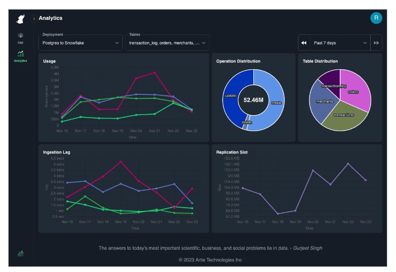
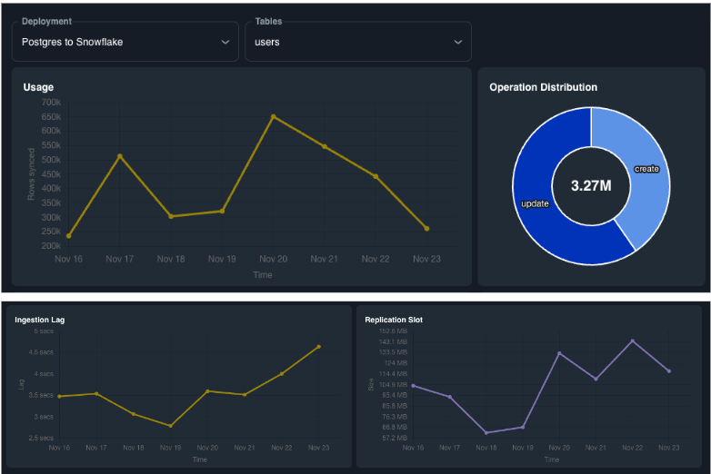
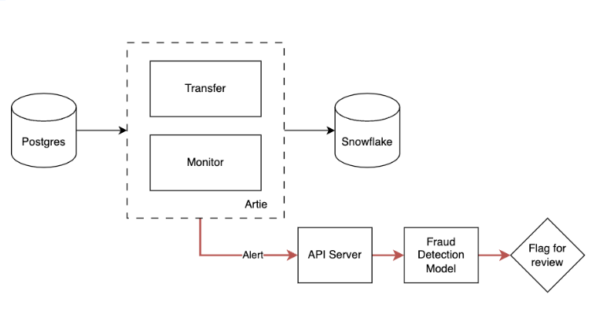

Artie is a real-time database replication solution. We leverage change data capture (CDC) and stream processing to perform data syncs in a more efficient way, which enables sub-minute latency and helps optimize compute costs. 
Today, we’re launching our Analytics Portal to provide visibility into our streaming pipelines and offer production level monitoring for related system infrastructure out-of-the-box.

**With the launch of our Analytics Portal**, we hope to help alleviate some of the challenges that data teams face when running their data stack. 
By offering real-time observability into database pipelines and peripheral infrastructure, we hope companies can increase understanding of how systems impact one another, reducing MTTD and generate proactive alerts to maintain robust infrastructure.

## Visibility is a key component in database replication

We started Artie to make database replication faster, less complex, and an overall better experience to manage. The core of database replication is transferring data in a timely, accurate, and reliable manner. 
In addition, there is a lot more happening in the peripheral, such as database monitoring, data pipeline visibility, data latency monitoring, and others. 

Data engineers need visibility to answer questions like:

* How many rows have been synced in the past hour? How does that compare to last month?
* What is the data latency for our organization’s three most important tables?
* What are the factors that impact data latency and how are those metrics trending?
* How are my systems performing?
  * Are there any database permission errors that may cause my data pipeline to go down?
  * Are my databases sized correctly? How is CPU, memory, and storage utilization?
  * Is my replication slot growing? By how much?

Setting up these metrics and monitors are important to help with debugging and maintaining a robust database replication solution. 
However, this requires **expertise and domain knowledge that may not be accessible at every company**.
There is also no standardization of which metrics to track and what benchmarks to follow. To make matters worse, when it comes to adopting cloud solutions, database/pipeline visibility is severely limited.
When pipelines break down, customers are often left in the dark, not knowing what broke, why it broke, and how to fix it.

## Artie's analytics portal reduces MTTD

We are extremely excited to announce our Analytics Portal to increase visibility and observability of our streaming pipelines.
This will provide insights into system level infrastructure and help with monitoring database and pipeline health. When identifying and resolving issues, one of the most important metrics is to reduce MTTD (mean time to detection). 
With Artie’s streaming pipelines and periodic jobs like [Postgres Watcher](https://docs.artie.com/real-time-sources/postgresql#postgresql-watcher), metrics are being sent to our Analytics Portal in-flight, as the underlying data is still being processed.

With the first iteration of our Analytics Portal, we are providing industry standard telemetry to streaming pipelines and related infrastructure. Data teams will be able to observe the following:

* Data ingestion latency by database and table.
* Operation distribution by database and table.
* Rows synced by database and table.
* Database monitors such as:
  * Replication slot size
  * Permission errors that may interfere with replication
  * Free Disk Space*
  * CPU Utilization*
  * Average Transaction Time*
  * Existence of long-running queries*

_* coming soon_

## Production level monitoring out-of-the-box

The Analytics Portal comes with prebuilt charts and monitors such that customers can drill down to get metrics at the deployment, database and table level.

Prebuilt monitors that we're launching includes:
* Database permission errors
* Replication slot growth (for Postgres users)

## Making the Analytics Portal more actionable

In the near future, we plan to enable row-based monitoring such that customers can write custom business logic. In addition to the pre-built charts and monitors that we provide out-of-the-box, we want to allow customers to create custom charts and configure views based on metrics that matter most to their business.

### Enabling business logic monitor

For example, you are a fintech that wants to monitor live transactions to detect fraud and abuse on your platform.

You have a `transactions` table which gets synced to your Snowflake instance. You should be able to plot a chart of average, medium, p95 and max transaction sizes across various lookback periods (30 min, 1h, 24h, 7d).

You can then set up monitors such as:
* Flag transactions that are 1.5 stdev above average and the merchant just signed up on the platform less than a week ago
* Flag key accounts where transaction volume where there's volume anomalies

Depending on how you'd like to be notified, we plan to support the following escalation channels:
* Email
* Slack
* Webhooks

In this example, the escalation channel sends a webhook to your API server, so you can run more rigorous checks.

If you’re interested in learning more, contact the Artie team at hi@artie.so.
