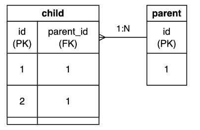

## Cascading changes

Cascading changes are used as a way to ensure referential integrity between related tables. Referential integrity refers
to the fact that all references in a database are valid.

Consider the following table:

<pre><code class="language-sql">
CREATE TABLE parent(
    id INT PRIMARY KEY
);

CREATE TABLE child(
    id        INT PRIMARY KEY,
    parent_id INT,
    FOREIGN KEY (parent_id) REFERENCES parent (id)
);

INSERT INTO parent (id) VALUES (1);
INSERT INTO child (id, parent_id) VALUES (1, 1), (2, 1);
</code></pre>

Which would create tables that look like this:

* In the child table, we have rows that are referencing the parent table (id = 1). As this is set up with as a foreign
  key constraint, we cannot delete the parent row with id = 1 without first deleting the child rows that reference it.
* However, with cascading deletes, we can delete the parent row and have the child rows automatically deleted.

You can use cascading changes to automatically apply certain actions to child tables based on what has occurred on the
parent table. In this blog, we'll do a deep dive of cascading changes and **reasons why you shouldn't use them**.

## Types of cascading changes

* Cascading updates (ON UPDATE CASCADE)
* Cascading deletes (ON DELETE CASCADE)

### Cascading updates

Cascading updates will detect primary key updates and automatically update references in the child table. To enable
this, we would do something like this:

<pre><code class="language-sql">
CREATE TABLE child (
    id INT PRIMARY KEY,
    parent_id INT,
    FOREIGN KEY (parent_id) REFERENCES parent(id) ON UPDATE CASCADE
);
</code></pre>

If I then update the primary key of the parent, all the child references will be automatically updated.

<pre><code class="language-sql">
UPDATE parent SET id = 2 WHERE id = 1;

SELECT * FROM child;
+----+-----------+
| id | parent_id |
+----+-----------+
|  1 |      2    |
|  2 |      2    |
+----+-----------+
</code></pre>

In practice, we rarely would use cascading updates as we would try to avoid and minimize the amount of times we would
need to change a table's primary keys since it could impact external applications.

### Cascading deletes

Cascading deletes will detect a delete in the parent table and automatically delete all the referenced child rows. To
enable this, we would do something like this:

<pre><code class="language-sql">
CREATE TABLE child (
    id INT PRIMARY KEY,
    parent_id INT,
    FOREIGN KEY (parent_id) REFERENCES parent(id) ON DELETE CASCADE 
);
</code></pre>

With cascading deletes, if I deleted an entry from the parent, the respective child entries will be automatically
deleted.

<pre><code class="language-sql">
SELECT * FROM child;
+----+-----------+
| id | parent_id |
+----+-----------+
|  1 |         1 |
|  2 |         1 |
+----+-----------+
2 rows in set (0.00 sec)

DELETE FROM parent where id = 1;
Query OK, 1 row affected (0.01 sec)

SELECT * FROM child;
Empty set (0.00 sec)
</code></pre>

## How are cascading changes different from triggers?

|              | Cascading changes                  | Triggers                                                                                                                             |
|--------------|------------------------------------|--------------------------------------------------------------------------------------------------------------------------------------|
| **Purpose**  | Maintaining referential integrity. | Can be used to execute a set of specific SQL statements.                                                                             |
| **Comments** | -                                  | Database triggers offer more expressive ways to execute code based on specified database changes such as insert, update and deletes. |

The key differences are:

1. [Database triggers](https://dev.mysql.com/doc/refman/8.4/en/trigger-syntax.html) are more expressive than cascading changes, it can be used to execute arbitrary SQL statements based on specified database changes.
2. Changes from a database trigger will show up in binlogs, **whereas cascading changes will not**. This may be an important consideration if you are using log-based replication.

## Why do we not recommend it in production?

* Cascading changes makes the database more susceptible to unintended changes
  * Deleting a record in the parent may trigger mass deletes to other child tables
  * You will most likely want to archive or soft delete the data instead of hard delete in order to keep it for historical purposes
  * It's extremely difficult to recover from an unintended delete as row changes will not appear in binlogs
  * If a deleted record has related records that needs to be deleted first, it's better to block and have users explicitly delete the dependent records first
  * For example: If you are an e-commerce company, and you delete a row in the `products` table and the `orders` table is set to cascade delete, you will lose all the order history for that product
* It makes debugging more difficult as other team members may not be cognizant of it
* Cascading changes are also bad for performance as it requires a serializable lock
  * A serializable lock will hold an exclusive lock on the resulting data and will block other transactions and queries from accessing the locked rows
  * This may lead to deadlocks and slow running queries

## How do you remove cascading changes if you have it enabled?

To remove cascading changes, you will need to recreate the constraint, below is a snippet of how you would do it:

First, you'll need to find the foreign constraint name
<pre><code class="language-sql">
SELECT CONSTRAINT_NAME FROM INFORMATION_SCHEMA.KEY_COLUMN_USAGE 
WHERE TABLE_NAME = 'child' AND COLUMN_NAME = 'parent_id';
+-----------------+
| CONSTRAINT_NAME |
+-----------------+
| child_ibfk_1    |
+-----------------+
1 row in set (0.01 sec)
</code></pre>

Once you have the constraint name, we can recreate it.

<pre><code class="language-sql">
START TRANSACTION;
-- (optional) Lock on the parent and child tables to prevent data changes
LOCK TABLES parent WRITE, child WRITE;

-- Drop the existing foreign key constraint
ALTER TABLE child DROP FOREIGN KEY child_ibfk_1;

-- Recreate the constraint
ALTER TABLE child ADD CONSTRAINT child_table_ibfk_1 FOREIGN KEY (parent_id) REFERENCES parent (id);

-- Unlock the tables (if locked)
UNLOCK TABLES;
COMMIT;
</code></pre>
