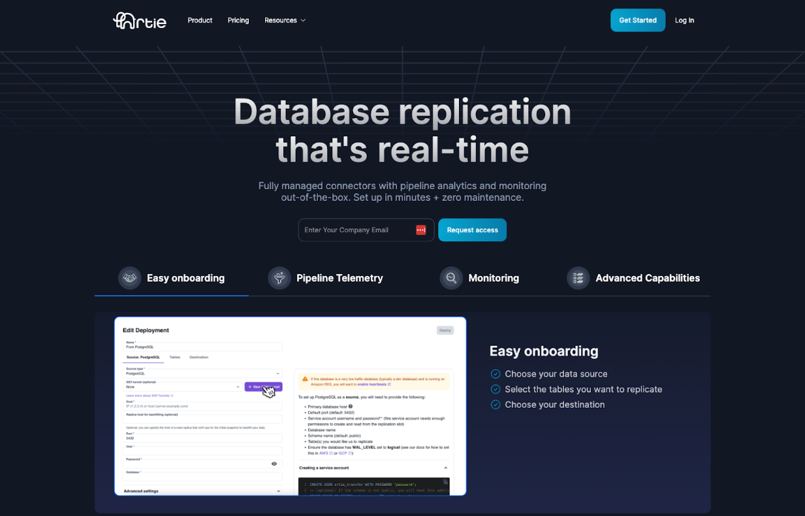
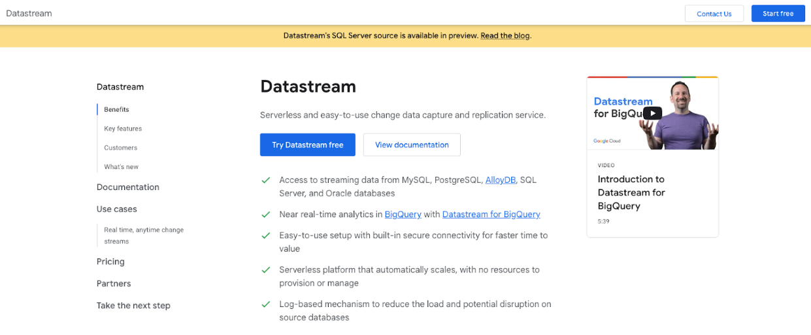
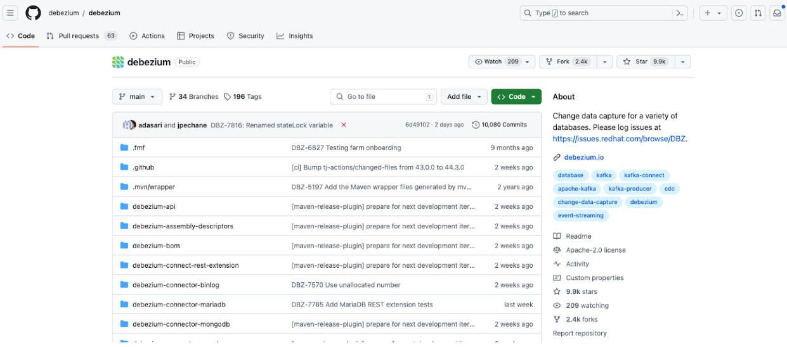
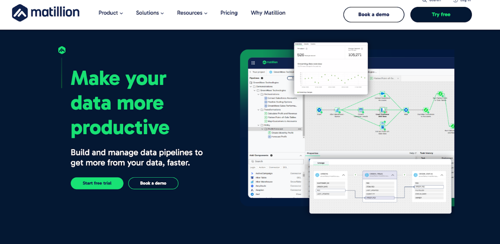

AWS Data Migration Service (DMS) was launched in 2016 as a database migration solution to help companies move database and analytics workloads to the AWS environment. AWS DMS supports migration from database sources that are on-premise, in Amazon EC2, and in Amazon RDS using change data capture (CDC) replication.

Companies that are AWS shops will typically explore DMS as a replication solution, given the convenience of staying with a single vendor. However, many customer complaints around reliability, scalability, and lack of data consistency have been reported, which can be extremely disruptive to companies that rely on data for day-to-day operations and expose data products to customers.

We’ve compiled a list of CDC and streaming pipelines for data engineering teams seeking alternatives to AWS DMS that can support low latency use cases. Note that this is not an exhaustive list but a great starting point.

## 1. Artie

Artie is a fully managed database replication solution that leverages change data capture (CDC) to move data in real-time and in a reliable way. Artie is primarily focused on moving data from OLTP sources to OLAP destinations, but covers some OLTP destinations as well.

Artie offers a 2 week free trial with no limits on volume and its Cloud offering is usage-based (counting monthly rows processed). Artie does not charge for backfills, only for incremental row changes.

Artie uses Apache Kafka as their pipeline’s external buffer, which means they are less likely to have data pipeline disruptions or require full resyncs due to data processing errors or connection issues. Having an external buffer also means there is minimal impact to source database performance and they do not perform database locks. Artie also has full schema evolution support, including handling deletes and DDLs, which means it's an easy to use and end-to-end solution that requires minimal management. Artie offers deployment analytics and monitoring out-of-the-box, providing more visibility to the pipeline. Support is offered via Slack Connect and email, allowing for fast response times.

Artie is recommended for companies that value reliability and accuracy of their production data and/or have use cases that require low latency. 

### Main benefits of Artie:

* Specializes in high-volume database replication
* Low latency
* Minimal impact to source database performance & no database locks
* Ease of use
* Highly responsive support team

## 2. Google Datastream

Google Datastream offers a serverless CDC replication solution. They help companies move data from transactional databases (MySQL, PostgreSQL, AlloyDB, SQL Server, and Oracle) to BigQuery.

Google Datastream’s pricing is calculated based on gigabytes (GBs) processed per month. Bytes are counted based on raw uncompressed data that’s written to the destination. Backfills and CDC streams are priced at different rates. Backfills use a flat rate of $0.40 per GB with the first 500GB free. CDC streaming price is tiered such that as usage increases, the price per GB decreases.

Google Datastream likely uses the databases’ oplog as the buffer for CDC changes as they incur oplog growth in source databases. They require some engineering work to get set up and do not fully support schema evolution, specifically dropping columns, changing data types, row deletes, and table truncations. They have a throughput of ~5MBPS.

Google Datastream is recommended for companies that are heavily reliant on the GCP ecosystem, have limited schema changes, and have the engineering resources to manage the overhead. 

### Main benefits of Google Datastream:

* Low cost
* Low latency
* Allows you to stay inside the GCP ecosystem.

## 3. Debezium

Debezium is a popular open source platform for change data capture. They make it simple to consume changes from a variety of transactional databases, including MongoDB, MySQL, PostgreSQL, Oracle, and others. 

Debezium is open source and is free to use. It will grab database changes and publish it to an external buffer such as Kafka or Kinesis. Companies that want a full database replication solution will need to set up a separate workflow (e.g. Flink/Spark) to consume from the CDC messages and write them to the destination.

Debezium is recommended for engineering teams that have experience in distributed systems and can dedicate significant engineering resources to set up, orchestrate, and maintain complex pipelines.

### Main benefits of Debezium:

* Free to use
* Highly configurable
* Covers most major transactional databases

## 4. Matillion

Matillion is a fully managed data pipeline company that was founded in 2011. They offer pre-built connectors from a variety of sources, including databases, applications, files, and events. Their replication methods include ETL, ELT, reverse ETL, CDC, and other database replication (full load, incremental).

Matillion offers a pay-as-you-go pricing model, starting from $1,000/month for the basic plan ($2.00/credit with 500 minimum credits) or $2,700/month for the enterprise plan ($2.70/credit with 1,000 minimum credits). Note that CDC replication is only available on the enterprise plan.  

Their solution is relatively easy to set up. However, they do not have clear documentation or tutorials and support is lacking, which makes self-serve more difficult. They also lack good integrations with Git and do not support CI/CD and Terraform. Matillion does not offer full support for schema evolution and requires some manual configuration to deal with certain data types (e.g. Postgres TOAST). 

Matillion is recommended for companies that have a variety of sources, want to avoid vendor lock-in, and want a solution that requires minimal management.

### Main benefits of Matillion

* No code/low code solution
* No vendor lock-in
* Supports large variety of connectors 

