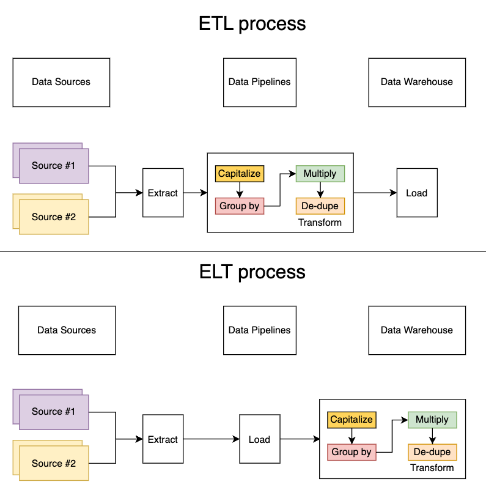

Every company nowadays requires data to inform their business decisions. In order to have data be readily accessible and stored in one place, companies have to set up various data integration pipelines.

These are the main components within the data integration stack:

* **Data sources**: this could be a service (internal or external), vendor, data management platforms, etc
* **Data pipelines**: to fetch data from various data sources and transfer them to the destination
* **Data warehouse**: to house and conduct queries  against the various data sources

The traditional data integration architecture looks like this:

* Data pipelines **extract** data from the various sources
* Data pipelines then **transforms** it into the specified format
* Data pipelines then **loads** the transformed data into a data warehouse

More recently, there has been a shift towards ELTs. With ELTs, the data integration architecture looks something like this:

* (unchanged) Data pipelines **extract** data from the various sources
* Data pipelines **load** the raw dataset into the data warehouse
* **Transformations** are then done within the data warehouse

## What are some examples of transformations?
Simplistically, transformations are any type of manipulation on the raw datasets to present a particular finding or view. Here are some examples of typical data transformations:

* Concatenation (such as combining columns and joining strings)
* Upper / lower case values
* Joining data sets
* Numerical operations (multiply, divide, add, subtract, etc.)
* Grouping data (by customer, by month, etc.)
* Deduplicating data
* Data obfuscation (scrubbing PII or credit card data)

There are endless amounts of possible transforms. To get a better understanding of what additional transformations may look like, [check out all the Snowflake functions](https://docs.snowflake.com/en/sql-reference/functions-all.html)!

## So, why are ELTs better?

1. Transformations are maintained by the team that works closer with the actual data
2. ELTs build upon a self-serve data culture and frees up engineering time
3. More ways to analyze the datasets

**Transformations are maintained by the team that works closer with the actual data**

Transforms can be implemented in SQL or with dbt from the data warehouse, as opposed to custom scripts in the data pipeline. 
This means that business analysis, data scientists, and others will be able to write their own transforms and maintain the definition.

**ELTs build upon a self-serve data culture and frees up engineering time**

With ELTs, the data team can write their own transformations and not have to rely on the engineering team to write custom scripts.

**More ways to analyze the datasets**

With the ETL approach, the process only outputs and uploads the transformed data set and is extremely rigid. 
As a result of this, it prevents others from performing additional queries and masks the underlying tables that are referenced in the transformation. 

Whereas with ELT, the raw data is loaded into the data warehouse and transformations are done within the data warehouse.

Artie Transfer helps companies adopt and supercharge ELT workflows by providing real-time data replication from transactional databases to your data warehouse.

[Contact us](https://artie.com/contact) if you're interested in learning more!
