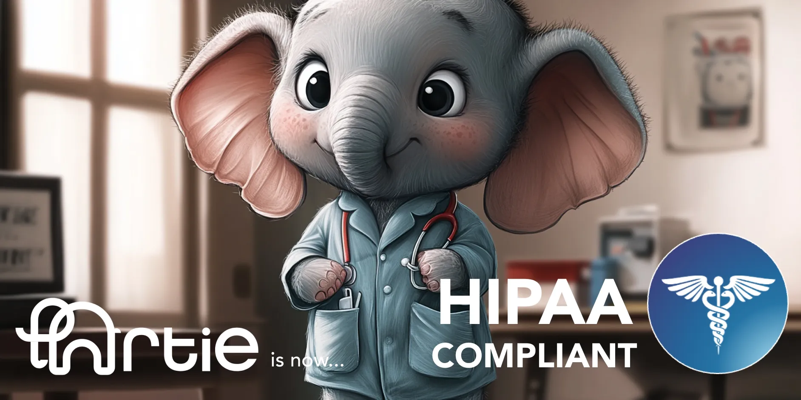

We're excited to announce that Artie has achieved HIPAA compliance, reinforcing our commitment to secure and reliable data replication solutions. With HIPAA compliance, our healthcare clients can confidently use Artie, knowing their sensitive patient data is protected to the highest standards.

This milestone enhances our real-time data replication services, ensuring they meet critical healthcare data privacy and security requirements.

Thank you to our team and clients for your trust in Artie. We're dedicated to continuing our work in providing secure, compliant data solutions.

Our policies, compliance report, and other details are available at our [Trust Center](https://trust.artie.com/).

If you would like to learn more about HIPAA, how to sign a business associate agreement (BAA), or hear more details on how Artie approaches data security, please reach out to [hi@artie.com](mailto:hi@artie.com).

