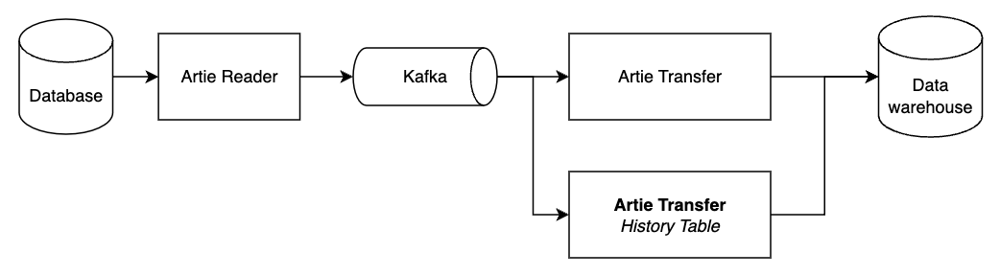
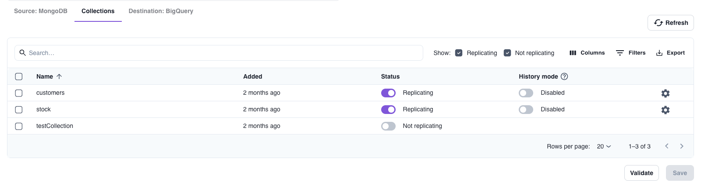

Artie is a real-time database replication solution that leverages change data capture (CDC) and streams processing to enable sub-minute latency. 
Today, Artie maintains a 1:1 copy of your source tables to your data warehouse.

With History Table, Artie will create a separate table that stores all historical changes of your source. 
Every data mutation (insert, update, delete) will be recorded along with a timestamp and the operation type.

## Example

Imagine you have a `customers` table with id and name. If **history mode is enabled**, we will create a separate table called `customers__history `with additional columns: `__db_updated_at`, `__artie_operation`.

Assuming we ran this:

<pre>
INSERT INTO customers (id, name) VALUES (1, 'Alice');
INSERT INTO customers (id, name) VALUES (2, 'Bob');
-- Updated Alice to include her last name
UPDATE customers SET name = 'Alice Smith' WHERE id = 1;
</pre>

The `customers__history` table would then fill up with values as such:

| id | 	name        | 	__db_updated_at	     | __artie_operation |
|----|--------------|-----------------------|-------------------|
| 1  | 	Alice       | 	2021-01-01 00:00:00  | 	CREATE           |
| 2  | 	Bob         | 	2021-01-01 00:00:00	 | CREATE            |
| 1  | 	Alice Smith | 	2021-01-01 00:01:23	 | UPDATE            |

## Snapshots vs CDC

A common way for companies to create variations of history tables is to perform regular snapshots of their current table. 
An example could be to take a daily snapshot. However, an obvious downside is that **only daily changes are recorded and intraday changes are lost**.

One major benefit of leveraging CDC is that **every single mutation is captured**, which provides a comprehensive view of all your data mutations.

## What are slowly changing dimension tables?

As a brief overview, there are 4 types of Slowly Changing Dimension (SCD) Tables. SCDs are a common data warehousing design pattern used to manage and track changes in dimension data over time. 
They are particularly useful for historical reporting and analysis.

| Type	 | Summary                                                                                                                                                        | Use Case                                                                                                                                          |
|-------|----------------------------------------------------------------------------------------------------------------------------------------------------------------|---------------------------------------------------------------------------------------------------------------------------------------------------|
| 1	    | When a change occurs, the existing record is updated with new information, which overwrites old data.	                                                         | When historical data is not necessary.                                                                                                            |
| 2	    | A new record is created with updated values while keeping old records. Each record is tagged with version or effective dates to distinguish between the rows.	 | Used when it's important to preserve and maintain a full history of changes.                                                                      |
| 3	    | This table includes an additional column that stores the previous values.	                                                                                     | Useful when it's necessary to track the current and immediate preceding value of an attribute.                                                    |
| 4	    | Uses a separate table to store changes. The main table holds the current data while history table keeps a record of all changes.	                              | Used when it's important to keep operational dim table lean and performant while still maintaining a detailed change history in a separate table. |

Using the prior example, this is what the different types of SCD would look like:

### Type 1

| id	 | name	       | __db_updated_at	      | __artie_operation | 
|-----|-------------|-----------------------|-------------------|
| 1	  | Alice Smith | 	2021-01-01 00:01:23	 | UPDATE            | 
| 2	  | Bob	        | 2021-01-01 00:00:00	  | CREATE            | 

### Type 2

| id | name        | __db_updated_at     | __artie_operation |
|----|-------------|---------------------|-------------------|
| 1  | Alice       | 2021-01-01 00:00:00 | CREATE            |
| 2  | Bob         | 2021-01-01 00:00:00 | CREATE            |
| 1  | Alice Smith | 2021-01-01 00:01:23 | UPDATE            |

### Type 3

| id | name        | __db_updated_at     | __artie_operation | previous_name |
|----|-------------|---------------------|-------------------|---------------|
| 1  | Alice Smith | 2021-01-01 00:01:23 | CREATE            | Alice         |
| 2  | Bob         | 2021-01-01 00:00:00 | CREATE            |               |

### Type 4

`customers`

| id | 	name        |
|----|--------------|
| 1  | 	Alice Smith |
| 2  | 	Bob         |

`customers__history`

| id | name        | __db_updated_at     | __artie_operation |
|----|-------------|---------------------|-------------------|
| 1  | Alice       | 2021-01-01 00:00:00 | CREATE            |
| 2  | Bob         | 2021-01-01 00:00:00 | CREATE            |
| 1  | Alice Smith | 2021-01-01 00:01:23 | UPDATE            |

## Artie leverages SCD Type 4 for simplicity and performance

Our initial launch of history table will support SCD Type 4, which is extremely useful when organizations need to balance fast access to current data with the need to maintain a detailed history of changes.

By maintaining a separate history table, SCD Type 4 ensures all historical data is preserved for detailed historical analysis without impacting the performance of the main current table. Queries against the current table will remain fast and efficient. In addition, this will keep it straightforward for customers to access current data, without having to filter through historical records and materialize the most current view. Since changes are tracked explicitly in a separate table, SCD Type 4 also reduces the risk of accidental data loss due to overwrites, which can happen in SCD Type 1.

## Examples

**Ecommerce company tracking price trends and inventory management**

Waves R Us sells beach toys. They have an inventory table that contains product information and available units. 
They use history mode to analyze their previous inventory levels to forecast seasonality with the goal of figuring out the optimal inventory levels per product.

**Fintech company tracking financial health to predict delinquency rates**

Instant Loans 4 U leverages history tables to track consumer credit scores, loan statuses and account balances over time to model probability of delinquency rates when it provides loans to consumers.

**Subscription company tracking user status and preference changes**

Live Elixirs is a subscription service for longevity elixirs. Live Elixirs leverages history tables to:
1. Understand customer taste preferences over time in order to improve their product
2. Understand subscription trends so they can predict and reduce churn

### Sign up to try Artie's history tables

Artie Cloud now has a one-click option to enable history tables. Customers can do this within the table list view.

[Contact us](https://www.artie.com/contact) if you're interested in trying Artie's history table.

