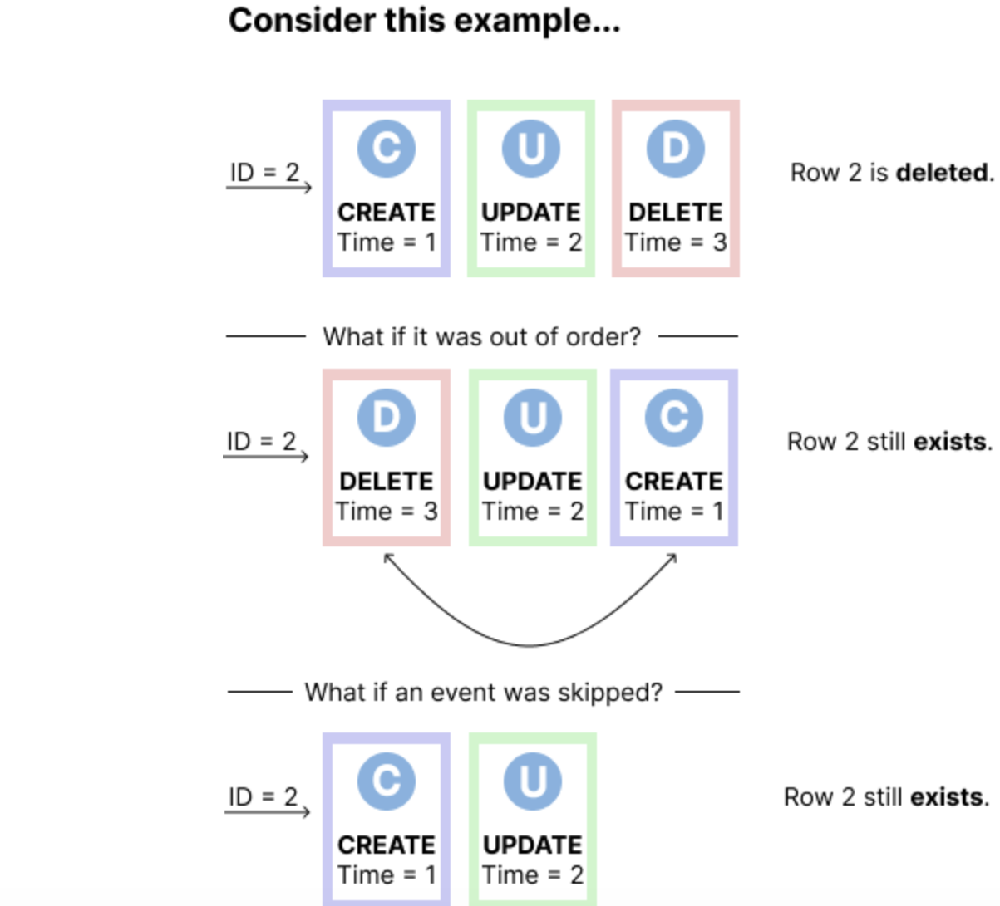
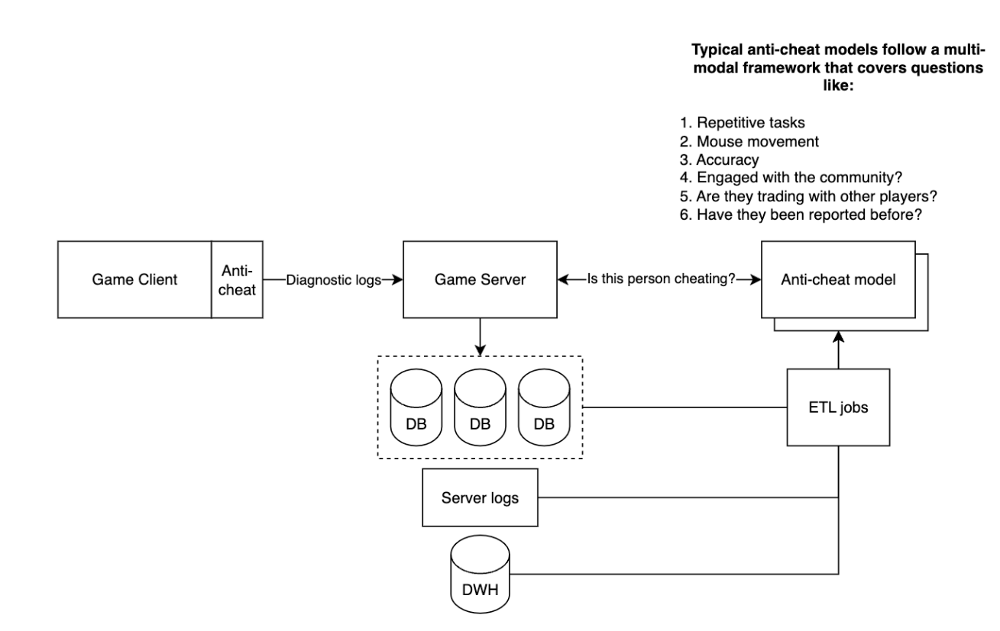
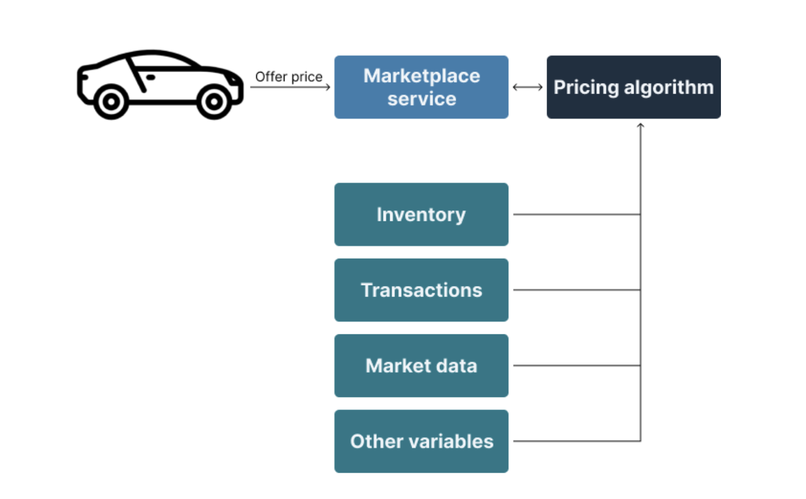

When you ask consumers if they want real-time data, the answer is always a resounding yes. Despite this, the data outside your transactional datastore is always lagged.

Often times, the effort required to bring the latency down is just not worth it. In this blog post, we will discuss:

1. The concept of data feedback loop
2. Why it's so hard to achieve real-time data
3. What use cases require real-time data

## Data feedback loop

The ability for a business to respond while the data is still relevant is incredibly valuable. By taking too long to respond may be catastrophic. 
For example, imagine a bank's alarm system going off 6 hours after the vault has been breached. This is why **MTTR (mean time to response)** is crucial metric to track in incident response.

So what is data feedback loop?

1. Implement a particular change
2. Data is then created and tracked
3. Data is then ingested 
4. Analysis is then performed

Often, we hear companies that say they don't need real-time because there is no business need. We would argue otherwise.
If they surveyed all of their customers, they would find that they would all want or benefit from having real-time. 
However, these businesses either haven't realized it yet or cannot make it happen because they don't have mature data strategy yet.

Having a solid data strategy is difficult and requires significant upfront investments, which is [why 70% of enterprises do not](https://www.globenewswire.com/news-release/2021/04/27/2217752/0/en/Seventy-Percent-of-Enterprises-Lack-a-Mature-Data-Strategy.html).
In lieu of this, companies are forced to draw upon instincts and intuition to make decisions.

## Why it's so hard to achieve real-time data?

The short answer is that it requires an upfront investment and continuous maintenance. 
We see lots of companies try and build a makeshift solution in-house to solve a particular use case, but it is not generalizable or scalable.

Let's dive into why this is so hard.

1. Are you using change data capture?
2. Is it designed for scale?
3. Can events be out-of-order?

**Are you using change data capture?**

How is your application set up to consume data mutations? The most common way companies do database replication today is either through periodic snapshots, or incremental syncs, which we [elaborate more here](https://www.artie.com/blogs/introduction-to-database-replication#types-of-replication). 
The short answer is that both of them do not scale well due to performance implications and edge cases.

Using change data capture is a heavy lift for most companies because it requires a deep understanding of each type of database internals, ability to handle schema changes and ensuring that changes are consumed regularly to avoid storage overflow or data loss.

**Is it designed for scale?**

Next, the solution should be able to scale efficiently to handle different volumes of data as well as potential traffic patterns.

Factors to consider:

1. Can the solution scale to multiple different data sources efficiently?
2. Can the solution handle < 100 tps to 1M+ tps (transactions per second)?
3. Is the solution deployed and running in a cost-effective manner? (Right compression settings, not over-provisioning, etc)
4. How easy is the solution to manage and operate?

**Can events be out-of-order?**

Last, the solution must ensure that there are no out of order events or missing events. One of the difficulties with working with change data capture is that it's extremely unforgiving.

* If you miss an event, you will require a full snapshot to catch up.
* If you have an out-of-order event, your eventual state of truth may be incorrect.

## Examples

### Gaming - Anti-cheat

One of the most obvious use cases of real-time data is fraud detection. It's easy to understand why real-time is needed - you don’t want to delay identifying fraudulent transactions or behaviors. 
The faster you can catch bad actors, the better. Anti-fraud is really broad, so let’s dive into the anti-cheat use case for video game companies.

Anti-cheat software is very important for a game’s success. Video games with high levels of cheating and hacking degrade player experiences and disrupt the in-game economy. 
This results in lower player engagement, increased refund rates, lower game ratings, etc. which ultimately means lower revenue and growth. 
There’s a research paper called [Video Game Anti-Cheat Software and Its Importance to a Game's Success](https://par.nsf.gov/servlets/purl/10344948) that goes more in-depth if you’re interested. 

You’re now thinking - surely video game companies already have anti-cheat processes leveraging real-time data in place. 
Yes, they do, and it looks something like the diagram below. 

The goal is not to eliminate cheating - that’s near impossible. The goal is twofold:

1. Increase accuracy in bot detection
2. Decrease time to detect bad actors

Having real-time or near real-time data streamed into the anti-cheat model actually helps with both these metrics. 
By having access to live data, the company is able to leverage online machine learning and dynamically adapt to new patterns in the data (incremental learning is another ML method that is applied with data streams). 
This means they can identify malicious behaviors such as bug exploits faster and more accurately.

### Vehicle marketplace

Another interesting application of real-time data pipelines is in ecommerce. For this example, let’s look at used vehicle marketplaces like Carvana or Shift, which buys and sells cars. 
Having near real-time data is important for determining pricing when purchasing used cars and to lower the number of days the car sits in their inventory. 

To determine the offer price, these marketplaces rely on pricing algorithms based on many variables. To keep things simple, let’s focus on two major variables:

1. Actual transaction data of new and used car sales from data providers
2. Inventory levels

Data from these two tables, along with many other ones, are fed into a data warehouse and AI algorithms determine the price and quantity to purchase for a specific vehicle make/model. Operations analysts leverage insights from the algorithm to determine how many Toyota Prii to buy and at what price.

What are the risks associated with having lagged data powering the AI pricing algorithm?

* If the algorithm cannot analyze actual used car transactions data in real-time, the company can mis-price (overpay or underpay). In the case of overpaying, the car is likely to be resold at a loss.
* If the algorithm does not have access to inventory levels in real-time, then it will not pause car purchases when inventory is "full". 
* If a company typically sells 10k Priuses per day, and they’ve already purchased 10k by noon, the company should stop buying Priuses. But if the data takes 6-12 hours to be updated, the company will likely over-purchase.

Both of these negatively impact contribution margins. With real-time data replication, the company can price more accurately, increase inventory turnover, and increase margins.

## Artie makes it easy for companies to adopt a real-time data strategy

We are on a mission to make real-time data accessible to companies of all sizes. Our managed solution allows you to set up data pipelines in minutes, not months.
[Contact us](https://www.artie.com/contact) to get started!
