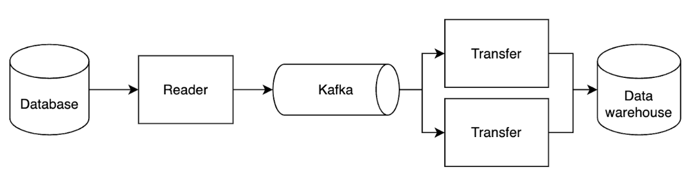

Being an avid data warehouse user, I was often frustrated by the limitations around data latency between the data warehouse and the production data that sits within transactional databases.

Depending on where I worked, the data lag varied from multiple hours to days, with the lag exacerbated by the volume of data.

# Why do you need real-time data?

Given that data warehouse is a platform, there are may use cases that can be enabled or empowered by having a shorter data lag. I'll go over examples below.

## Ops heavy companies

Operations heavy companies typically have constantly changing business processes and ops people often leverage a variety of no-code tools such as Zapier, Typeform, Retool and others to keep up with process changes.

These tools can stack on top of each other and reference data in the data warehouse. The efficacy of the solution created from the no-code tools are then partially impacted by the data replication lag.

## Lifecycle and Paid Marketing

Within lifecycle marketing, it is common to purchase [marketing automation tools](https://en.wikipedia.org/wiki/Marketing_automation) such as Iterable, Braze, Klaviyo, etc.
Each of these tools have their own version of what a user model and events should look like, such that teams can create templates such as: `Hello {{first_name}}`!

Examples of additional user attributes that may be sent:
- **Paid marketing.** Once the customer requests a ride, we'd like to send as many customer traits as possible to destinations like Google and Facebook so their algorithm can find more look-alikes.
- **Nurture campaigns.** When a customer signs up on our website, we'd like to put them in a drip campaign that welcomes and onboards the customer. We'd like to reference dynamic fields like product iterations.
    - Did they do anything more than just sign up?
      -Did they play around with our platform?

## Critical tables that everyone depends on
Every company has a subset of tables that are critical to the business. These tables are typically used by multiple teams and are the source of truth for the company.

Having them replicated to data warehouses effortlessly and in real-time is a value multiplier.

| Industry     | Critical Tables                |
|--------------|--------------------------------|
| E-commerce   | Orders, Customers, Products    |
| SaaS         | Users, Accounts, Subscriptions |
| Marketplaces | Orders, Customers, Products    |
| Real Estate  | Inventory, Offers, Customers   |

# So why hasn't this been done before?
As many have chimed in [here,](https://www.reddit.com/r/dataengineering/comments/1393kdj/why_would_you_ever_not_use_cdc_for_elt/) it is not that real-time replication is not useful. It is extremely valuable, but it's often far too complex for any particular engineering team to dedicate resources to set up.

Also, it's really hard to maintain and streaming pipeline errors are extremely unforgiving. A typical data engineering team also has to maintain many other pipelines, so it's difficult to justify this level of investment.

## So how are companies solving this problem today?

Typically, companies are solving this problem today by doing the following:

1. Performing periodic data dumps by taking a database snapshot, sanitizing the data, and then uploading it to the data warehouse.
2. Leveraging incremental syncing such as `SELECT * FROM table WHERE updated_at > last_synced_at` and syncing only the deltas.
3. Using third-party SaaS tools like Fivetran, Stitch, and others to manage the pipeline.

Each of them has its obvious drawbacks:
1. Data dumps are extremely resource intensive and can take hours to complete.
2. Incremental syncing is error-prone, inability to record deletes and can also be slow.
3. Third-party tools are expensive, limited in their capabilities, not set up for scale and can be difficult to use.

# Introducing Artie

As technologists, we believe that approaching zero replication lag between OLTP and OLAP databases should be the norm and widely accessible.

Artie enables OLTP data to be streamed continuously to the data warehouse and reduces replication lag from hours to days down to seconds. This will allow companies to unlock new use cases and empower their teams to make better decisions.

This is how Artie works under the hood:

- OLTP logs are consumed by Debezium and Artie Reader, which publishes the messages to Kafka.
- Each table has its own Kafka topic, partition keys are the primary key(s) of the table.
- Artie Transfer reads from Kafka topics, detects schema changes, and writes to your destination. Schema changes are merged automatically (read [our design principles](https://www.artie.com/blogs/not-all-cdc-pipelines-are-created-equal#4-minimizing-data-indigestion) on schema support for more detail).

To support this workload, Artie Transfer has the following features built in:

1. **Automatic retries and idempotency**. Artie will only commit the Kafka offset when the data has been successfully written to the destination. If there are any processing errors, it will hard fail.
2. **Automatic table creation**. Artie will automatically create the table in the designated database if it does not exist.
3. **Error Reporting**. Provide your Sentry API key and errors will be reported to your Sentry project.
4. **Schema Evolution**. Artie detects column changes and applies any necessary DDLs to your destination tables.
5. **Scalability**. Our architecture can handle 1GB or 100+ TB of data.
6. **Sub-minute latency**. Artie is continuously draining your Kafka topic. You do not need to set a scheduler.
7. **[Telemetry](https://docs.artie.com/telemetry/overview)**. Artie is integrated with Datadog. All processing telemetry such as how many messages are processed and flush time are all available.

## Making this easy for teams to onboard

As we mentioned before, a big reason for low adoption of CDC replication is that it’s complex and requires a ton of engineering investment.
We've worked tirelessly on making the onboarding experience seamless and intuitive.
Simply enter your source details, highlight the tables you want to sync, enter your destination details, and we will spin up all the infrastructure and handle backfills. We built Artie so teams can set up CDC pipelines in minutes.
