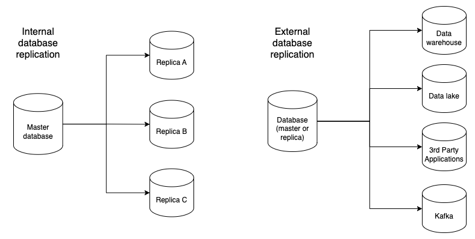

## Database replication

Database replication is a cornerstone in achieving a robust, scalable, and fault-tolerant data management infrastructure. Database replication is a key component in data management, involving the creation of multiple copies of a database across different servers or locations. This process ensures data redundancy, reliability, and performance. Data accuracy and latency are two important factors in database replication to ensure reliable access to data for decision-making and operational continuity. 

On a high level, there are two broad categories of database replication: internal and external.

| Types    | Definition                                                                           | Goals                                                                                                                                                |
|----------|--------------------------------------------------------------------------------------|------------------------------------------------------------------------------------------------------------------------------------------------------|
| Internal | Data is synced from a primary or master database to secondary or replica databases.  | High availability. To have standby replicas in case the primary database is unavailable.   Load balance workload to achieve higher performance.  |
| External | Data is synced to destinations outside of the database cluster.                      | Varies, but includes supporting different access patterns and types of workloads.                                                                    |

## Replicating into data warehouses

The importance of database replication extends to the realm of data warehousing, where it plays a vital role in maintaining up-to-date and synchronized data across various systems. Data in the data warehouse is then used by downstream workloads to perform machine learning, experimentation, business intelligence, and reverse ETLs, among others. 

Replicating data from operational databases to data warehouses is a critical process for several reasons:

1. Separation of operational and analytical workloads
2. Centralizing data
3. Scalability of data systems
4. Backup and disaster recovery

**Separation of operational and analytical workloads**

Operational (OLTP) databases are optimized for transactions, such as CRUD operations: creating, reading, updating, and deleting records. OLTP databases are characterized for having high throughput and low latency, and are meant for applications with well-known access patterns.

Data warehouses on the other hand, are designed for analytical processing (OLAP) and specifically optimized for fast query performance on large volumes of data, with the ability to perform more freeform queries. 
Replicating data from databases to data warehouses separates these two distinct types of workloads, ensuring that the performance of operational systems is not impacted by analytical queries, which can be resource-intensive.

Read more [here](https://www.artie.com/blogs/what-are-the-differences-between-oltp-and-olap-databases) on the differences between OLTP and OLAP databases. 

**Centralizing data**

Data replication allows companies to consolidate data from multiple sources, including various databases and other data systems (i.e. SaaS sources such as Salesforce and Zendesk data), into one centralized location (i.e. a data warehouse). 
This consolidated view in a data warehouse is essential for comprehensive analytics, business intelligence, customer support, financial reporting, and providing a more complete picture of the organization's operations.

**Scalability of data systems**

Data warehouses are designed to handle very large volumes of data and are more scalable for storing historical data than transactional databases. This helps organizations efficiently manage their data storage.

**Backup and disaster recovery**

Having data replicated in a data warehouse can serve as a form of backup. In case of a failure in the operational database, the data in the data warehouse can provide a recent copy that can be used for recovery purposes.

## Change data capture

Change data capture (CDC) is a technique used to track changes in a database. CDC captures changes to data in real-time and makes them available for further processing, such as replicating it into a dara warehouse.
CDC is efficient - it minimizes the amount of data that needs to be transferred, as it only captures the changes made to the data, rather than the entire dataset.

### Types of replication

| Type                      | Description                                                                                             | Trade-offs                                                                                         |
|---------------------------|---------------------------------------------------------------------------------------------------------|----------------------------------------------------------------------------------------------------|
| Full table replication    | Replicates the entire table each time the job runs                                                      | Simple to implement, but can be inefficient for large tables                                       |
| Incremental replication   | Only replicates the changes made since the last replication                                             | More complex to implement, but more efficient for large tables.   Cannot capture hard-deletes  |
| Trigger-based replication | Uses triggers to capture changes as they happen. Can capture all changes, including hard-deletes        | Can be inefficient for large tables, as triggers creates database load.                            |
| Log-based replication     | Uses the database's transaction log to capture changes. Can capture all changes, including hard-deletes | Most efficient, however extremely complicated to set up and requires heavy engineering investment. |

## Challenges

There are several key challenges with database replication that we often see:

1. Data consistency
2. Scalability
3. Latency

**Data consistency**

Ensuring data consistency across multiple databases is a key challenge in database replication. This includes ensuring that data is replicated accurately and in the correct order. 
Inconsistent data can lead to incorrect results in downstream analytics and decision-making. This is particularly hard for log-based replication where the order of changes is crucial and also missing one event can lead to data inconsistency.

**Scalability**

Certain types of replication can introduce overhead to the source database which may limit the amount of tables you can replicate and the frequency at which you can replicate data.

**Latency**

Latency is the time it takes for data to be replicated from the source to the destination. High latency can lead to outdated data in the data warehouse, which can impact the accuracy of analytics.

### Artie is an out-of-the-box solution for log-based database replication

Artie leverages CDC and stream processing to perform database replication to data warehouses in real-time. 
Artie takes all the headaches out of setting up log-based replication and provides you an easy-to-use dashboard.

[Contact us](https://artie.com/contact) to discuss your use case and start a 14-day free trial.
