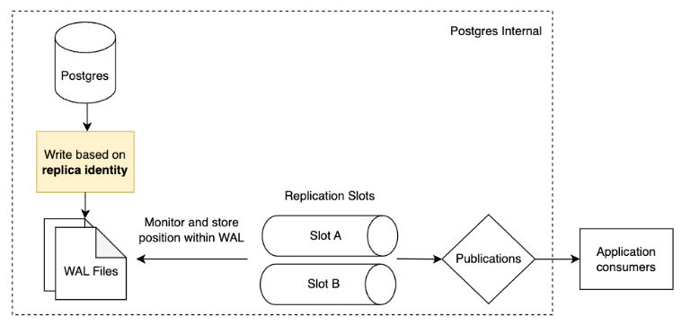

## Intro

This is the first part of our deep dive into Postgres logical replication. In this part, we will focus on
the `REPLICA IDENTITY` property of a table and how it affects logical replication.

## Table replica identity

Postgres tables require a replica identity to be configured in order to capture the changes made to the table.
Replica identity specifies the **type of information written to the write-ahead log** with respect to what the
**previous values were**.

By default, replica identity will use the table's primary keys as the identifiers.

Our goal with this blog post is to demystify the concept of replica identity and explain why you would
want to alter your replica identity in certain situations. We also discuss performance implications and other factors to consider.

## Components required for logical replication

The key components to logical replication:

1. Table replica identity
2. Write-ahead logs
3. Replication slots
4. Publications

Notes:

* Replica identity will tell us what previous values to record
* Replication slots will monitor and record their own position within the WAL files
* An application will then need both a **replication slot** and a **publication** to start consuming changes from logical
  replication.

| Component        | Description                                                                                                                                                                                                           |
|------------------|-----------------------------------------------------------------------------------------------------------------------------------------------------------------------------------------------------------------------|
| Write-ahead logs | Postgres uses write-ahead logs (WAL) internally to record every database transaction. You can control how much information is written by toggling `WAL_LEVEL`, which we will cover in another blog post.              |
| Publication      | A publication is a collection of tables that you want to replicate. Changes made to those tables are then captured and sent to subscribers.   You can create a publication with the `CREATE PUBLICATION` command. |

## What are valid values to use for replica identity?

You can change a table's replica identity by running a command like this:

<pre><code class="language-sql">ALTER TABLE table REPLICA IDENTITY value;</code></pre>

The valid settings are:

1. `DEFAULT`
2. `USING INDEX index_name` (must be unique)
3. `FULL`
4. `NOTHING`

For this section, we are using this as the example.
<pre><code class="language-sql">CREATE TABLE customers (
    id integer DEFAULT nextval('inventory.customers_id_seq'::regclass) PRIMARY KEY,
    first_name character varying(255) NOT NULL,
    last_name character varying(255) NOT NULL,
    email character varying(255) NOT NULL UNIQUE
);

CREATE UNIQUE INDEX customers_email_key ON inventory.customers(email text_ops);

INSERT INTO customers (id, first_name, last_name, email) VALUES (1001, 'Sally', 'Thomas', 'sally.thomas@acme.com');

UPDATE customers SET first_name = 'Sally #2', last_name = 'Thomas #2' where id = 1001;</code></pre>

### Default

The default replica identity is the primary key(s) of the table. If you are trying to replicate a table that does not
have primary key(s), you can either alter the table to add keys (see our
guide [here](https://docs.artie.com/tutorials/tables-without-primary-key-s)), or you can modify the replica identity
to be `FULL`.

**Kafka message produced by Debezium**

Partition Key:
<pre><code class="language-json">{"payload":{"id":1001}}</code></pre>

Message:
<pre><code class="language-json">{
    "payload": {
        "before": null,
        "after": {
            "id": 1001,
            "first_name": "Sally #2",
            "last_name": "Thomas #2",
            "email": "sally.thomas@acme.com"
        },
        "op": "u",
        "ts_ms": 1716575453417,
        "transaction": null
    }
}</code></pre>

### USING INDEX index_name

The `USING INDEX` replica identity will capture the columns of the index you specify. The index must be unique and its columns must be `NOT NULL`.

**Kafka message produced by Debezium**

Partition Key:
<pre><code class="language-json">{"email":"sally.thomas@acme.com"}</code></pre>

Message:
<pre><code class="language-json">{
    "payload": {
        "before": null,
        "after": {
            "id": 1001,
            "first_name": "Sally #2",
            "last_name": "Thomas #2",
            "email": "sally.thomas@acme.com"
        },
        "op": "u",
        "ts_ms": 1716575622471,
        "transaction": null
    }
}</code></pre>

### Full

The `FULL` replica identity will capture all the columns of the table.

**Kafka message produced by Debezium**

Partition Key:
<pre><code class="language-json">{"payload":{"id":1001}}</code></pre>

Message:
<pre><code class="language-json">{
    "payload": {
        "before": {
            "id": 1001,
            "first_name": "Sally",
            "last_name": "Thomas",
            "email": "sally.thomas@acme.com"
        },
        "after": {
            "id": 1001,
            "first_name": "Sally #2",
            "last_name": "Thomas #2",
            "email": "sally.thomas@acme.com"
        },
        "op": "u",
        "ts_ms": 1716575379815,
        "transaction": null
    }
}</code></pre>

### Nothing

The `NOTHING` replica identity will not capture any columns of the table. This will cause an error when you try to update
a table with this replica identity.

<pre><code class="language-sql">ERROR:  cannot update table "customers" because it does not have a replica identity and publishes updates</code></pre>

## Why would you consider changing the table's replica identity?

The main use case for changing replica identity is to change from `DEFAULT → FULL`. You would typically do this for two
reasons:

1. You don't want to deal with TOAST columns
2. You need the previous row value

**Scenario 1: you don't want to deal with TOAST columns**

In a nutshell, [TOAST columns](https://debezium.io/blog/2019/10/08/handling-unchanged-postgres-toast-values/) are large columns where the values will not be written to WAL if the values did not change.
This then means that your downstream application needs to understand the TOASTED value placeholder and handle it
accordingly.

_For Artie customers, we automatically detect and handle this by adding conditional update clauses._

If you’re not using Artie, you can handle TOAST columns by doing something like this:

<pre><code class="language-sql">UPDATE target t SET t.toast_column = s.toast_column FROM staging as s WHERE t.id = s.id;</code></pre>

_To handle a TOAST column, we leverage CASE statements._

<pre><code class="language-sql">UPDATE target t
SET t.toast_column = CASE
WHEN ( s.toast_column != 'TOASTED_VALUE_PLACEHOLDER' )
THEN s.toast_column ELSE t.toast_column
END
FROM staging AS s
WHERE t.id = s.id;</code></pre>

**Scenario 2: you need the previous row value**

One common reason we change replica identity to `FULL` at Artie is that we need the previous values in order to replicate a deleted row to a downstream table that has cluster keys specified.

For example, you may have a table called `accounts`, and in Snowflake the table is clustered by `DATE_TRUNC('day', created_at)`. We will need the `created_at` for the previous row if we want to replicate a `DELETE` event.

**Workaround**

If you need `created_at` and don't want to change the replica identity, you can add `created_at` to be part of the table's primary key.

<pre><code class="language-sql">ALTER TABLE customers DROP CONSTRAINT customers_pkey; 
ALTER TABLE customers ADD PRIMARY KEY (id, created_at);</pre></code>

This is a great workaround for tables that have a lot of TOAST columns.

## Impact on performance

TL;DR -

* Changing table replica identity from `DEFAULT → FULL` on a table-by-table basis is mostly fine.
* You should expect some increase to your database CPU with `FULL` replica identity.

By setting replica identity to `FULL`:

1. There will be more information written into WAL files, which may increase your disk usage. That being said, WAL files
   are temporary since they are periodically purged, so the increase in disk usage is temporary.
2. There will be more load on the network to propagate WAL to the replicas and subscribers, which may increase your CPU.

The actual incremental load depends on:

* The volume and distribution between `INSERT`, `UPDATE`, `DELETE` events. `INSERT` doesn't have previous data, so it would not
  increase load.
* How wide the columns are and whether there are a lot of TOASTed columns.

[Click here](https://xata.io/blog/replica-identity-full-performance#benchmarking) to see benchmark data from Xata.

