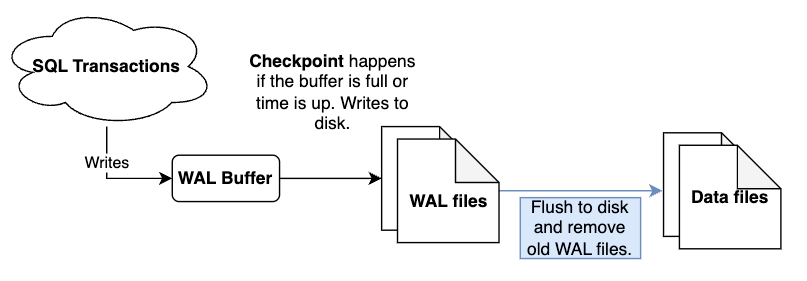
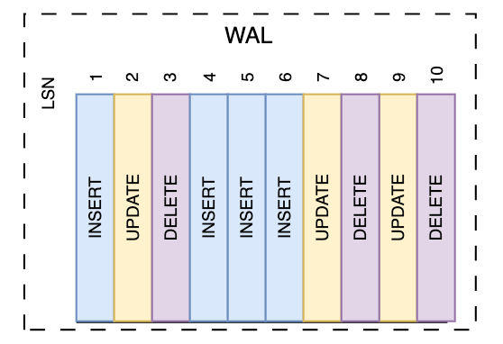

## Intro

This is the second part of our deep dive into Postgres logical replication. If you haven’t read through part one on [replica identity](https://www.artie.com/blogs/postgres-table-replica-identity), be sure to check that out. 
In this part, we’ll discuss how write-ahead logs work, why you want to use them, and their various components and settings.

## Write-ahead logs

Write-ahead logs are one of four components required for logical replication. They are used to ensure data durability, meaning your data is consistent and protected against data loss. Even if a server machine fails, write-ahead logs ensure your changes persist. 

While WAL is enabled by default in Postgres, it’s important that your disk space meets all of the requirements necessary to use WAL files. You can configure different parameters to determine how much information is written to logs and the amount of shared memory they contain. 

## How do write-ahead logs work?

Write-ahead logs store each state change as a command with a unique identifier within an append-only file. Each of the commands in this append-only file contains all the information needed to replicate the change.

It stores these commands BEFORE any changes are made. Once the change is committed, the record is marked, indicating to the system that the change was already made. If the system fails, it can read the commands sequentially within the logs, starting from the one it left off on.

Postgres then purges the logs when a checkpoint is complete and the data has been flushed to disk. 

## Components of write-ahead logs

1. Logs
2. Checkpoints
3. Buffers
4. Log sequence numbers (LSN)
5. Replication slots

## Logs

WAL logs are the files in which various transactions are stored. These logs are written to disk before the changes are made to the database.

### Checkpoints

Checkpoints are points in the sequence of transactions within a log file where all the data is guaranteed to have been updated with the information before the checkpoints. 
These are particularly important in crashes since the WAL file recovers from the most recent checkpoint. This is then where the system performs the REDO operation. 

### Buffers

Postgres refers to buffers as the working units that read and write data to your tables. The buffers of write-ahead logs are typically called transaction log buffers. 
These determine the amount of memory allocated to storing WAL data which we will configure later in the article when we look at the **wal_buffers** parameter. 

### Log sequence numbers (LSN)

Log sequence numbers are 64-bit integers assigned to individual transactions within a WAL, indicating the INSERT position. 
They are byte offsets unique within a single log stream that increase with each new transaction and are of data type pg_lsn. LSNs can help determine the amount of data in bytes between different transactions. 

### Replication slots

Replication slots are reservations for a replication connection to send WAL data to a replica. They are used to safeguard against losing data. Postgres uses them to retain data necessary for WAL, ensuring it is not removed until all necessary changes have been made. 

## WAL settings

There are several important parameters you can set to control database performance while using WAL. These include:

* `wal_level`
* `fsync` and `wal_sync_method`
* `wal_buffers`
* `checkpoint_flush_after`
* `max_replication_slots`
* `max_slot_wal_keep_size`

### wal_level

This setting controls how much information is written to your logs. In the case of Postgres replication, you will most likely want to use the default of replica. 

However, there are three possible values for **wal_level**:

* `minimal` - only writes the minimum amount of information to the logs. This is not recommended for production.
* `replica` (default) - writes enough information to allow for replication
* `logical` - writes enough information to allow for logical replication. This is needed to **enable change data capture**.

### fsync and wal_sync_method

The `fsync` parameter determines whether WAL files are written to disk. By default, this is set to on. You should not disable this setting as it can lead to data loss in the case of a crash.

When `fsync` is enabled, you can then specify the specific method to write to WAL files to disk by changing `wal_sync_method`. This parameter is set to `fsync` by default.

* `fsync` (default)
* `open_datasync`
* `fdatasync`
* `fsync_writethrough`
* `open_sync`

We recommend using the default settings for both of these parameters, unless you are trying to finetune these settings for performance or adapt to your specific hardware.

### wal_buffers

This refers to the amount of shared memory used for WAL data that hasn’t yet been written to disk. The default of -1 is usually just right for optimal performance. 
Increasing this value will increase the shared memory used by WAL, making it so we don’t have to continue committing to disk. 

In the case of buffers, setting this to a large value will not typically yield a huge benefit. However, it could help improve write performance on servers with multiple commitments happening at the same time, increasing response times after checkpoints. 

The default of the synchronous_commit parameter being on will prevent the risk of durability in the event of a crash. Durability should only be a concern if `synchronous_commit = off`.

Because **wal_buffers** can only be set at the server start, it is recommended that you set this in the postgres.conf file. You can set this value by running the following command `ALTER SYSTEM SET wal_buffers = 12MB;`

### checkpoint_flush_after

This parameter allows you to specify the number of pages before already-written data should be flushed to disk. When configured correctly, it helps reduce latency on transactions inserted to WAL.

By flushing data to disk, you are reducing the amount of dirty data in the cache, helping to improve updates out to disk (fsyncs) at checkpoints. This then affects the duration of checkpoints and the memory consumed during them. 

A value of 0 disables forced writebacks but may improve performance for normal-sized data operations. A high **checkpoint_flush_after** value will improve performance on bulk data operations but may dramatically increase the size of the pg_wal_directory.

You can set this value by running the following command `ALTER SYSTEM SET checkpoint_flush_after = 8MB;`

### max_replication_slots

**max_replication_slots** refers to the maximum number of replication slots that can be used by the server. A replication slot can only be consumed by one process at a time. To use this parameter, wal_level must be set to replica or higher. The default of this parameter is 10. However, if you change this, keep in mind that it can’t be lower than the current number of slots, or the server will not start. 

To change the value of this parameter, run the following command `ALTER SYSTEM SET max_replication_slots = 20;`

### max_slot_wal_keep_size

This parameter specifies the maximum size of the WAL files that the replication slots retain at the time of checkpoint. The size helps to limit the amount of data written to disk while also considering potential lag caused by replication. If the units are not specified, then it defaults to megabytes.

To see the size of your replication slots:

<pre><code class="language-sql">SELECT
  slot_name,
  wal_status,
  pg_size_pretty(
    pg_wal_lsn_diff(
      pg_current_wal_lsn(), restart_lsn)) AS retained_wal,
  active,
  restart_lsn 
FROM pg_replication_slots;</code></pre>

## Why use write-ahead logs?

Losing data is a nightmare for any data engineer. WAL provides disaster recovery that you may not otherwise get. Write-ahead logs allow for data integrity and consistency when replicating changes from the primary database log. 
Because changes are first written to WAL, the primary database doesn’t have to sacrifice performance. You really can have the best of both worlds!

While WAL does increase I/O, the overall performance of systems with it enabled tends to be more favorable than those without. This is due to two main behaviors of WAL - **sequential writes** and **checkpoints**. 

WAL leverages sequential writes to the database rather than random writes. Sequential writes are more efficient, allowing transactions to be committed faster and the system to be more performant. 

Checkpoints within WAL prevent the need to write data to files right away. First, data is written to WAL files in sequential order. Second, an async process is triggered by the **checkpoint_timeout** or **max_wal_size** parameter, whichever comes first. 

Another concern of write-ahead logs is their use of storage. Luckily, WAL is ephemeral and will be periodically purged from your database based on your retention settings. As long as your database storage does not grow, a maximum of 1GB of WAL will work well.

## Conclusion

Write-ahead logs can be a game-changer for disaster recovery when working with Postgres replication. They provide lots of different parameters to ensure it works with your database, giving you the confidence that you need to make changes to your database. 
