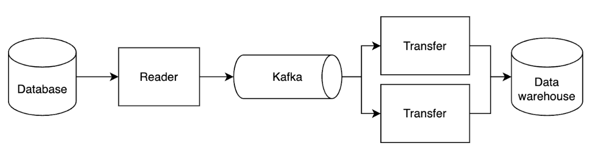

# Not all CDC pipelines are created equal

There are many ways to leverage change data capture (CDC) to perform data replication from databases to external destinations, like data warehouses, data lakes, and other databases. CDC is simply a mechanism for detecting changes and the way the pipeline is implemented can significantly impact performance and day-to-day maintenance requirements. In this blog, we run through the design principles we followed when building Artie and reasoning behind our architectural decisions.

Design principles we followed at Artie

1. Push > Pull
2. Never lose our position in the transaction logs
3. Consistency is king
4. Minimize data indigestion

## 1. Push > Pull

Push-based replication means the source database pushes CDC logs as soon as they’re captured, whereas pull-based replication means incremental changes are pulled out by querying against the database. Push-based replication minimizes load as it does not require running queries, and therefore minimizes impact on database performance.

## Never lose our position in the transaction logs

Transaction logs are database operation logs (oplogs) in which every insert, update, and delete operation is recorded. These logs are ephemeral and there is a background process that will advance and purge old oplogs. Each database has their own special name for it, along with how long the data is retained.

| Database   | Name                   | Data Retention Period             |
|------------|------------------------|-----------------------------------|
| PostgreSQL | 	Write-ahead Log (WAL) | 	Configurable                     |
| MySQL      | 	Binary Logs (binlog)  | 	Configurable                     |
| MongoDB    | 	Change streams        | 	Configurable (defaults to 192MB) |
| DynamoDB   | 	DynamoDB streams	     | 24 hours                          |

When replicating data using [log-based replication](https://www.artie.com/blogs/introduction-to-database-replication), losing your position in the transaction log can lead to two things:

1. Database crashing due to storage overflow
2. Data loss as the logs have been purged

To minimize risk of losing our place in the transaction logs, we leverage an external buffer and separate processes for reading and writing the logs (see sections below). We use Kafka as our external buffer.

### Using Kafka as on external buffer

As we mentioned, using the transaction logs as the buffer may lead to storage overflow issues if there are any errors with downstream data processing. As data folks know, inevitably there are errors that pop up. Additionally, using transaction logs as the buffer means that data processing cannot be partitioned and therefore cannot be parallelized, which is a big constraint when processing high volumes of data.

At Artie, we prefer to use Kafka as our external buffer to leverage:

* Data compression and compaction
* Guaranteed ordering
* Ability to parallelize processes by fine tuning topic partitions
* Pub-Sub capability – ability to have different consumer groups (to support history tables for example) without having to publish the message to Kafka more than once
* Telemetry (calculate lag by time and row count based on the offset)

### Having separate processes for reading and writing

To create a more fault-tolerant architecture and avoid issues that arise from inevitable data processing errors, we decided to split reading and writing into separate processes (typically, DAGs or batched jobs are executed by a single process).

Reader subscribes to the source’s transaction logs, expresses each data mutation as a message, and publishes messages to Kafka
Writer (Artie Transfer) consumes the data from Kafka and replicates the data to the destination
By separating the two processes, we are able to accomplish the following:

Keep Reader’s logic to a minimum to reduce the amount of possible errors. This is important because Reader erroring out means the transaction log will start to build up.
Defer complex logic to happen after the external buffer. This is beneficial because complex logic is more prone to errors - quite simply, by doing more things, more things can go wrong. Some complex logic that Artie Transfer handles include writing to destination tables, handling edge cases like TOAST columns, and parsing values to ensure data integrity of data type and precision.
This all means that when data processing errors occur, we do not have problems with transaction log build-up or losing our position in the logs. For example, if there are connection issues and we are not able to write to the data warehouse, the logs continue to buffer in Kafka without impacting the source database. Artie Transfer will simply seek the previous offset and continue processing when we reconnect.

## 3. Consistency is king 👑

When there are errors related to data processing, data pipelines have two options:

1. Skip and move on to keep the pipeline running
2. Hard fail and cause head-of-line blocking

Majority of data pipelines default to (1) which leads to issues related to data consistency, like having missing rows. 
For data pipelines that use transaction logs as the buffer, skipping errors and moving on is sometimes the logical solution to avoid risking [replication slot overflow](https://www.artie.com/blogs/preventing-wal-growth-on-postgres-db-running-on-aws-rds#:~:text=Replication%20slot%20overflow%20happens%20when,is%20due%20to%20AWS%20heartbeats.).

At Artie, we decided that low latency is meaningless without data consistency. This means we choose (2) and cause head-of-line blocking. 
This means we have to deal with the headache of managing all the different edge cases and data types that could cause errors, but this also means that our customers do not have to deal with the overhead.

Examples of fun edge cases we have seen:

1. Timestamp value where the year exceeds the YYYY format and causes downstream encoding issues
2. Negative years
3. Non JSON values in a JSONB column
4. JSON values that are not JSON compliant, like `{"foo": "bar", "foo": "bar"}`

## 4. Minimize data indigestion

What do we mean by data indigestion? Data pipelines inevitably run into errors such as message mismatches, networking errors, and many others that can cause blockage. 
Due to our stance on hard failing on data indigestion errors, we have various features built into Artie to minimize manual overhead.

### Support for schema evolution

Whenever columns get added or removed from source tables, Artie automatically detects and applies the necessary changes to the destination.

### Adding columns

When we detect a new column, we either reference the source schema (if available), or we infer the data type from the first not-null value in the CDC event. 
After determining the new column’s data type, we will then alter the table in your destination to add the new column(s).

### Dropping columns

By default, dropped columns will not be dropped in the destination to prevent downstream compilation issues or data loss. However, customers that want dropped columns to be dropped can opt-in to hard deletes, and Artie will automatically drop the column(s).

Dropping columns is a much harder problem to solve, especially because the operation is irreversible. If a column is accidentally dropped, that requires a full snapshot to get it back (which is extremely disruptive).

### Schema inference

Inference is particularly useful for databases that do not provide a schema like MongoDB.

If we need to create a new column, we will look at the first not-null value and inspect its data type to create the column.

If the column already exists, Artie enables customers to control the destination schema. Once the column is created, Artie will look at the data type in the destination and automatically cast values to match. We will only hard fail if the values are incompatible with the new data type.

To get a sense of how this works, refer to the table below.

| Activity                              | Example                       | Supported                                                        |
|---------------------------------------|-------------------------------|------------------------------------------------------------------|
| Change from closed to open data type	 | Go from **BOOL** to **TEXT**	 | ✅                                                                |
| Change from open to closed data type	 | Go from **TEXT** to **BOOL**	 | 🟠 Artie will try, but may fail if invalid values are passed in. |

There are many nuances to building CDC pipelines. We designed Artie to tackle the common challenges in data replication and create a reliable solution by focusing on data consistency, minimizing data indigestion, and supporting schema evolution. 

Book a [demo](https://www.artie.com/contact) to learn more.
