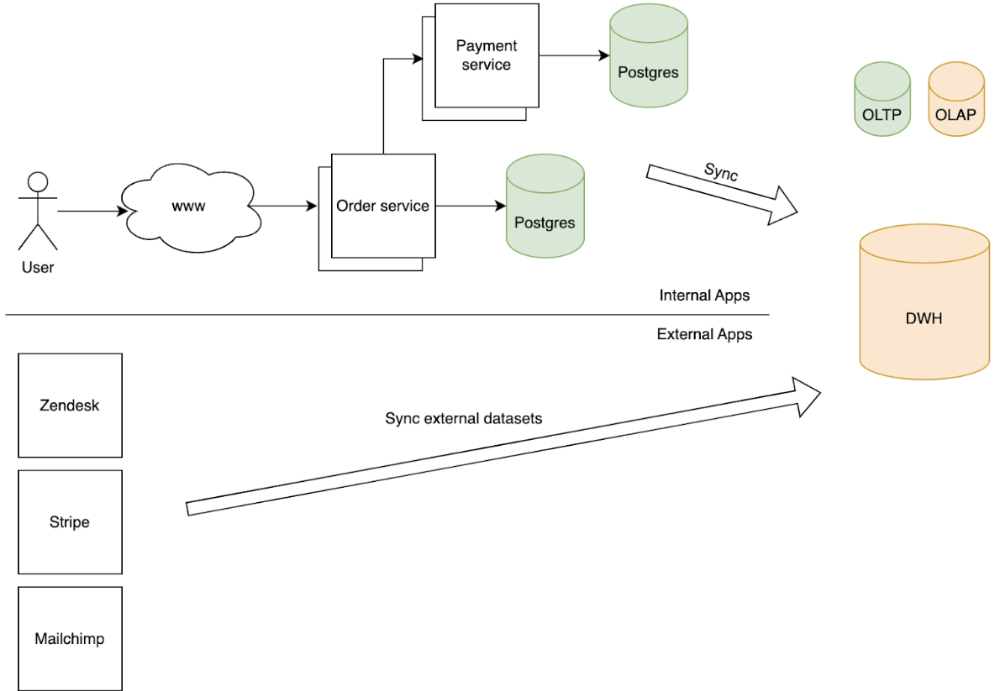

When differentiating between databases, one key characteristic is whether the database is OLTP or OLAP. In this blog post, we will explore what they are, key differences and cover real-world examples.

# What is OLTP and OLAP?

## OLTP

**Online Transactional Processing (OLTP)** databases are characterized for having a high throughput, low latency transactions.

OLTP databases are known for having strong data integrity, transactions support and indices to support well-known access patterns.

OLTP databases are used to enable applications to serve requests for applications such as:

* Is this person authenticated?
* Processing a credit card payment
* Connecting a rider with a driver

## OLAP

**Online Analytical Processing (OLAP)** databases primarily consists of read-heavy workloads and are primarily used for data analysis.
While performance is still important, it is less critical compared to OLTP.

Example of such queries:

* How many customers are signing up each month?
* What is the total number of rides per city?
* What is the average rating of a driver?

## Key Differences

| Category                  | OLTP                                                                                                                                          | OLAP                                                                                                   |
|---------------------------|-----------------------------------------------------------------------------------------------------------------------------------------------|--------------------------------------------------------------------------------------------------------|
| Access patterns           | Well-known. Queries are optimized by creating indices to support their access patterns.                                                       | Ad-hoc. OLAP databases allow for dynamic queries across multiple data sets and are extremely flexible. |
| Type of workload          | Reading, updating and deleting. This is most suitable for applications to process incoming requests.                                          | Read-heavy. OLAP databases are used for data analysis and reporting.                                   |
| Relational vs. NoSQL      | OLTP can be relational or NoSQL.                                                                                                              | OLAP is typically relational.                                                                          |
| Scope of data aggregation | Database level. You can only join the data that resides on the server.                                                                        | We can join this data across different database instances, services and more.                          |
| Main users                | Internal application. Note the singularity of the statement. It's generally advisable for each application to have its own database instance. | Data analysts   Data scientists   Machine learning engineers                                   |
| Performance               | Operations are measured in milliseconds. Performance is hypercritical.                                                                        | Operations are measured in seconds. Performance is important but not as critical as OLTP.              |
| Examples                  | Amazon RDS, MySQL, PostgreSQL                                                                                                                 | Amazon Redshift, Google BigQuery, Snowflake                                                            |

## Putting things together

In this diagram, the customer would place an order which would result in data being saved in the Order Postgres DB. The order service would also make an API call to the Payment service which has its own DB as well. There would be internal processes (typically ETL jobs) that are periodically run to synchronize the data within the service transactional database into the company’s data warehouse.

Separately, there would be processes to synchronize external data from Zendesk, Stripe, Mailchimp.
The exact methodology would depend on the vendors’ capabilities.
There are vendors that have native integrations with selected data warehouses, others require custom integrations via their API.
Companies like Fivetran, Airbyte, Rivery provide connectors that integrate with the tools’ API and load the datasets into your data warehouse.

## How does Artie bridge the gap?

[Artie’s Transfer](https://www.artie.com/blogs/introducing-artie-transfer) product is able to drastically improve companies’ internal processes by streaming and only applying the changes to the downstream data warehouse. By doing so, Transfer is able to reduce the latency between the two systems from hours/days to seconds.

Artie Transfer has the following features built in:

* Automatic retries & idempotency. We take reliability seriously and it's feature 0. Latency reduction is nice, but doesn't matter if the data is wrong. We provide automatic retries and idempotency such that we will always achieve eventual consistency.
* Automatic table creation. Transfer will create the table in the designated database if the table doesn't exist.
* Error reporting. Provide your Sentry API key and errors from data processing will appear in your Sentry project.
* Schema detection. Transfer will automatically detect column changes and apply them to the destination.
* Scalable architecture. Transfer's architecture stays the same whether we’re dealing with 1GB or 100+ TB of data.
* Sub-minute latency. Transfer is built with a consumer framework and is constantly streaming messages in the background. Say goodbye to schedulers!

If you are interested in learning more check out [Transfer’s GitHub repo](https://github.com/artie-labs/transfer), schedule a demo here or drop us a note at [hi@artie.so](mailto:hi@artie.so)!
