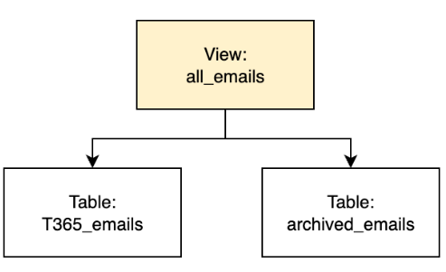

Configuring Redshift can be very confusing. There are hundreds of knobs that customers can tune within Redshift, which unfortunately means that teams are often stuck with low performing Redshift clusters because it wasn't configured correctly. This guide helps highlight five of the highest leverage features that can vastly improve performance and cost.

## Upgrade to RA3 nodes if you are still on DS2

DS2 is short for Dense Storage nodes. DS2 nodes are designed for heavy analytic workloads that require large amounts of storage, and are optimized to provide cost-effective storage for large amounts of data that have relatively moderate computational requirements.

RA3 is a newer generation and more performant node that Redshift offers that was designed with the ability to scale compute and storage independently. Storage is backed by S3 and is not tied to the node itself, which allows compute and storage to be scaled independently. Moreover, RA3 can automatically manage storage tiers and cache hot data in the highest performing local storage. This allows for more flexibility and higher performance, with a performance to cost ratio that is 2x higher than DS2 nodes. RA3 nodes are often used for large workloads where performance and cost management are both critical.

More information on RA3 vs DS2 [here](https://aws.amazon.com/blogs/apn/amazon-redshift-benchmarking-comparison-of-ra3-vs-ds2-instance-types/).

## Ensure cluster CPU is at a healthy level

If your cluster CPU usage is consistently high, this typically means that the cluster is working very hard to execute queries.

High CPU utilization can lead to many issues and performance bottlenecks, such as:

* Longer query response times, sometimes resulting in timeouts or failures.
* Increased number of queues and further increasing wait times.
* Lower efficiency in processing tasks.
* Potential for thermal throttling in extreme cases, which reduces compute power.

Note that it’s completely fine for cluster CPU to spike to >80% occasionally, but it is not advisable for CPU usage to be consistently high.

When CPU usage is consistently >80%, automated tasks such as automatic table optimization, auto vacuum, and auto analyze will not run. Automated tasks like these should ideally run weekly, the exact cadence can be found by looking at Redshift Advisor or STL_ALERT_EVENT_LOG.

There are many ways to mitigate high CPU usage and the best strategy will depend on your workload. Here are some strategies to consider:

* Optimize queries for better performance. This could mean rewriting queries and ensuring tables are properly vacuumed and analyzed.
* Implement workload management (WLM) to prioritize critical queries and manage resources between different user groups.
* Resize the cluster by adding more nodes or upgrading to a more powerful node type.
* Set up alerts to notify you when CPU utilization exceeds a threshold so you can take proactive steps.

## Enabling more than one WLM for better memory allocation

Use workload management (WLM) to prioritize workloads better such that fast running queries are not backlogged by long-running queries. An example of a long-running query could be a query that pulls all metrics across all product and business lines, and aggregates them into a business report for leadership teams to review.

By creating more than one WLM queue, you can allocate resources much more efficiently. WLM will automatically match a running query to a queue based on the user or query group that is associated with the query configuration.

Multiple queues are not turned on by default! Most companies that are running their own Redshift cluster (not serverless) would benefit from having at least three queues:

1. Queue for data ingestion
2. Queue for reporting
3. Queue for analytics

Three is a good starting point even for basic workloads. While you can create up to eight queues per cluster, having too many queues could complicate the setup and add overhead.

To enable additional WLM queues, specify this as a parameter group within your Redshift cluster. Click [here](https://docs.aws.amazon.com/redshift/latest/mgmt/workload-mgmt-config.html) for more details.

## Concurrency scaling to handle time of day traffic

Concurrency scaling is another feature within WLM that can increase the performance of read operations and common data ingestion write operations.

When concurrency scaling is turned on, Redshift automatically adds additional cluster capacity to process increases in read and write queries. Essentially, this is a separate concurrency scaling cluster that offloads certain workloads from the main cluster. Instead of waiting in the queue, eligible queries (see limitations on supported queries) will be processed by the concurrency scaling cluster.

We recommend enabling this for all Redshift clusters. Note that you are only billed for the time actively spent running queries. Additionally, this feature is available for free 1 hour per day per cluster.

* Read more on [concurrency scaling](https://docs.aws.amazon.com/redshift/latest/dg/concurrency-scaling.html).
* Implement hot and cold storage for stateful time series data

If you have stateful data that follows a time series pattern, you could benefit from implementing hot and cold storage.

### Hot / cold storage example

Company ABC has a table that logs every email sent and there are updates to annotate whether the email was delivered, bounced, unsubscribed, etc.

This table will only get larger over time. However, most business workloads only relies on the data that ranges from T7 to T365 (trailing # of days). Without implementing cold or hot storage, the performance of upserting will take longer over time as there is an increasing amount of data to scan.

Instead of having one Redshift table called emails, implementing hot and cold storage with T365_emails and archived_emails will improve query performance and also help optimize storage costs.

A first iteration of this approach could look something like this:

* For recent emails, you can directly query `T365_emails`
* If you want to be able to see all emails, you can query `all_emails`

This means that all the data still lies in Redshift’s managed storage which costs around $0.024 per GB ($24 per TB).

If you have tons of infrequently used data, storage can be optimized further with Redshift Spectrum which allows you to execute SQL directly against S3. 
By choosing the right storage tier (infrequent, one zone, glacier, etc.), you could further optimize costs down to as low as $0.00099 per GB ($1 per TB).

