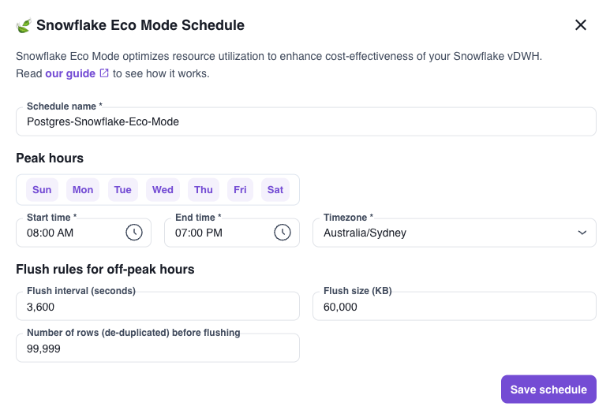

**Snowflake Eco Mode is an advanced setting that allows customers to minimize time and maximize resource utilization of their Snowflake virtual warehouse.**

We built Snowflake Eco Mode for customers that may only need faster syncs during business hours.

Take Company Acme Bread as an example. They offer customer support from Monday to Friday, 8AM to 6PM. For the `support_ticket` table, they could set the following rules:

* During peak hours, sync every 10 seconds.
* Off-peak hours, sync every 6 hours.

## How Snowflake Eco Mode helps you save money

Snowflake charges customers off of compute and storage. Customers provision a Snowflake virtual warehouse to process incoming queries and size their virtual warehouses according to workload. 
From our discussions with customers, typically 70-90% of customers' Snowflake bill comes from compute.

Note that virtual warehouses are billed based on time utilization (down to the second), regardless of usage capacity. 
Which means running at 100% capacity for 1 minute costs the same as running at 1% capacity for 1 minute. By defining peak and off-peak times, customers can maximize resource utilization.

In our example with Acme Bread, the `support_ticket` table is set to off-peak about 70% of the time **which results in Snowflake virtual warehouse cost savings of 65-70%.**

## How does Snowflake Eco Mode work?

To get started, define peak and off-peak hours along with flush (sync frequency) preferences on our dashboard.

<small>In this example, we are syncing every hour during off-peak hours.</small>

As a quick refresher, Artie flushes data based on three variables.
1. Time 
2. Bytes processed 
3. Rows processed

Whichever one happens first will trigger a flush cycle.

## Zero impact to your database

> Will syncing less frequently impact database performance or risk replication slot overflow?

No, it does not! We do not rely on a database's oplog as our processing buffer, so there is no accumulation of CDC logs. 
Whenever there are new events in your oplog, we automatically publish that into our Kafka cluster as an external buffer. 
As such, **your oplog never builds up**. We discuss this in-depth in our blog on [our design principles](https://www.artie.com/blogs/not-all-cdc-pipelines-are-created-equal#using-kafka-as-an-external-buffer).
