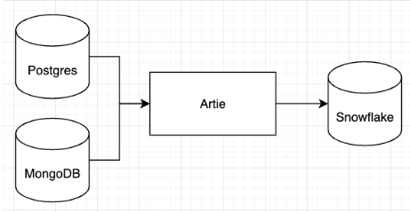

Keep, a Canadian credit card and payments company, uses Artie to sync business-critical production data from Postgres and MongoDB into Snowflake in real-time. With Artie, the team was able to move operational dashboards to Snowflake and decrease query load on their production databases. 

> Artie has been a foundational component of building our data stack. As a data-driven fintech startup, we wanted all the benefits of fast and reliable database replication, without having to invest months of engineering time to build and maintain a robust pipeline. We now can focus on building products that our customers love.
>
> <cite>-- Helson Taveras, Co-founder & CTO</cite>

# Key Takeaways

1. Keep wanted an easy and fast way to get data into Snowflake. They needed all their production data in Snowflake to track business-critical KPIs that impact daily workflows across product, engineering, sales, and business operations teams.
2. They chose Artie for its **ease of use, real-time syncs, and exceptional customer support experience.** 
3. With Artie, the team is able to move critical dashboards to Snowflake and increase performance of their production databases (by decreasing query load). Artie’s history mode feature, which provides a detailed audit log, offers peace of mind with respect to regulatory and compliance requirements.

## Looking for the fastest and easiest way to get data into Snowflake

Keep is growing rapidly and needed to move analytics functions off of their production databases. The data team wanted a centralized source of truth for all their data that sits across Postgres, MongoDB, and Segment.

They ultimately chose to use Snowflake as their data warehouse and use Metabase to create dashboards to track business-critical KPIs that help inform day-to-day workflows across product, engineering, sales, and business operations teams.

Data ingestion is, of course, a key component of getting the data they need into Snowflake. Helson Taveras, co-founder and CTO of Keep, knew he did not want their engineering team to build data pipelines in-house. They wanted engineering to stay focused on building a great product that helps differentiate them from their competitors, instead of building and managing data pipelines. 

## Artie just works and enables real-time operational use cases

> The Artie team went above and beyond, even offering suggestions on database configurations to help us maintain a healthy infrastructure environment. They were a lifesaver and helped us avoid issues around running out of disk space in our Postgres WAL, which would have been disastrous.

Helson Taveras wanted a no-code ETL solution that they can easily set up and never have to manage. The team evaluated several SaaS ETL solutions and chose Artie for several key reasons:

1. Ease of use. Setting up a connector took only 10 minutes and was extremely straightforward. Artie also offers real-time pipeline visibility into rows synced, ingestion lag, and replication slot size, among others.
2. Ability to support real-time use cases. As a data-driven team, Keep wants to operationalize their data, so they can make **real-time decisions, such as credit underwriting and trust & safety checks**. These capabilities will **lower risk on their platform and help increase customer trust**. 
3. Exceptional support experience. Artie not only offers real-time replication but, to the team’s delight, also provides near real-time support. 

## Speed of innovation drives higher adoption of the Artie platform

With Artie in production, the data team confidently moves business critical dashboards to Snowflake, knowing they have fast and reliable pipelines. This shift also reduces query load on Postgres and MongoDB, resulting in improved application performance. 

> When we purchased Artie, we didn’t realize how quickly they would build features critical to our workflow. It’s amazing to know that we’re working with an innovative team that’s dedicated to building the best database replication solution and relevant tooling around it that others just aren’t focused on. 

A surprising benefit of adopting Artie? The platform supports the creation of **true slowly changing dimension tables with change data capture**, which can be **enabled with one-click**. For a fintech company scrutinized by regulatory bodies, maintaining a detailed audit log of all transactions and changes made on their platform is incredibly valuable for compliance reasons. 

**About Artie**: [Artie](https://www.artie.com/) is a real time data replication solution for databases and data warehouses. Artie leverages change data capture (CDC) and stream processing to perform data syncs in a more efficient way, which enables sub-minute latency and helps optimize compute costs. With Artie, any company can set up streaming pipelines in minutes without coding.

**About Keep**: [Keep](https://www.trykeep.com/) provides credit card and payment services to Canadian businesses. The company's platform provides a checking account and credit card to get better cashback rewards on card spending, lower domestic and international wire fees, currency conversion at a reasonable price, and increased credit limits for working capital.
