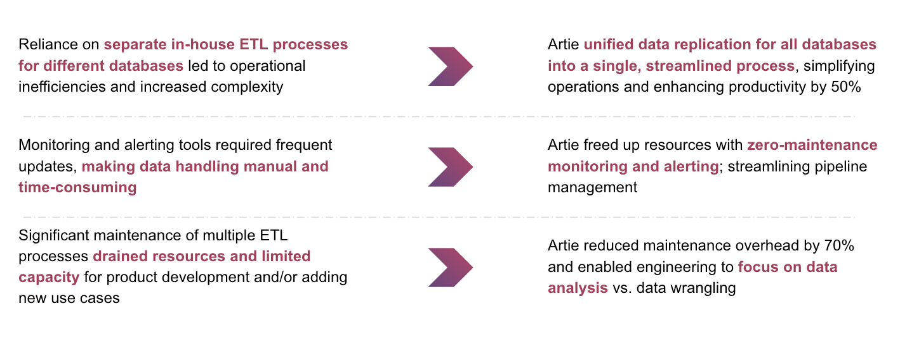
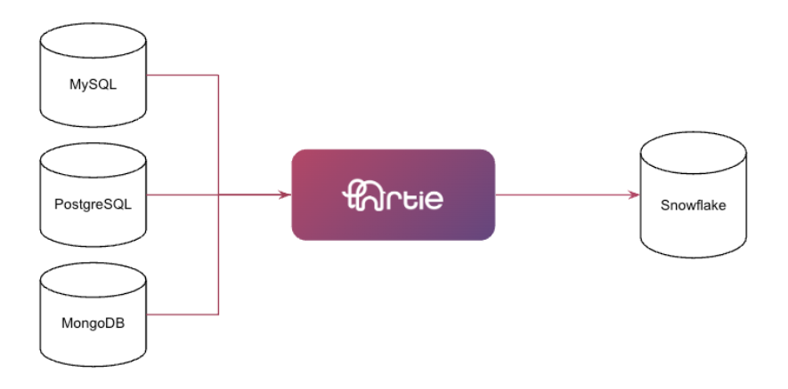

Papaya, a leader in mobile bill payments, faced a growing challenge: their data infrastructure struggled to keep pace with rising demand. With Artie, they found a solution that transformed their ETL process, empowering them to streamline data ingestion and scale their operations effortlessly.

_Artie has been an absolute game-changer for our CDC ETL process. Before integrating Artie into our workflow, we struggled with inefficiencies and time-consuming maintenance that drained our resources. Since adopting Artie, we've experienced a remarkable boost in productivity and a significant reduction in time required to maintain our ETL processes._

—— Daniel Clendenning, Senior Software Engineer

## TL;DR

 
## Key results

* Consolidated multiple batch ETL processes into a single CDC solution across all databases
* Eliminated development overhead and drastically reduced maintenance overhead by 70%
* Implemented reliable monitoring and alerting tools that requires zero-maintenance
* Optimized Snowflake usage; reducing utilization by 30% despite achieving real-time syncs

## Data stack

* Pipeline: Artie
* Destination: Snowflake
* Data Sources: MySQL, PostgreSQL, MongoDB
* Business Intelligence: Looker

## Papaya’s challenges with maintaining an in-house ETL solution

Millions of consumers across diverse industries in America rely on Papaya to simplify their bill payments. With Papaya’s mobile application, businesses get paid faster and more frequently, and Papaya’s simple and convenient payment methods help alleviate stress and anxiety Americans face upon paying bills. Vikas Prabhakar and Daniel Clendenning, VP of Engineering and Senior Software Engineer at Papaya, needed to replicate data from their transactional databases to Snowflake for analytics and initially built Papaya’s data ingestion tool in-house.

It took Daniel and his team more than 10 months to build an in-house batch ETL solution. While this solution could replicate data from MySQL and PostgreSQL to Snowflake, adding MongoDB as a source posed a new challenge and Daniel had to resort to building this pipeline separately with Airflow jobs, which took another 3 months. This added complexity slowed down day to day operations by up to 30% due to increased maintenance overhead.

One missed bill payment can be detrimental to a business, and Daniel’s team spent an additional 3 months adding monitoring and alerting systems but this required constant improvements. Data pipeline management was highly manual, and instead of spending time focusing on data analysis and new product developments, Daniel’s team spent countless hours developing and maintaining existing pipelines.

_"The biggest pain points were the maintenance of the two different ETL processes, the development time for adding new sources to our Airflow ETL process, and monitoring and alerting that needed improvements."_

—— Daniel Clendenning, Senior Software Engineer

As Papaya’s user base expanded, their in-house solution struggled to keep up with the growing data volumes without escalating maintenance costs.

## Artie eliminates data ingestion overhead

Vikas and Daniel introduced Artie to streamline data replication from MySQL, PostgreSQL and MongoDB to Snowflake: goal was to replace the existing ETL tools with a single CDC solution. Daniel’s team was amazed at Artie’s setup simplicity. Within minutes, they connected MySQL, PostgreSQL and MongoDB to Snowflake, something that previously took several months to achieve.

After implementing Artie, the Papaya team quickly retired their in-house tool so they no longer needed to spend hours debugging pipelines, and could spend more time on data analysis and product development instead. Artie’s CDC solution had now ensured a 1:1 sync between Papaya’s databases and Snowflake; and Daniel’s team grew to love and depend on Artie for their data consistency.  

_"The biggest business values that Artie has provided for us are the time savings versus maintaining our own CDC ETL process and the confidence we have in the consistency of our data."_

—— Daniel Clendenning, Senior Software Engineer

With Artie’s monitoring and alerting tools, Daniel’s team could now easily monitor their data pipeline performance all on a [single analytics dashboard](https://www.artie.com/docs/monitoring/analytics-portal) and moving onto a CDC solution meant that they had real-time visibility into their pipeline. Suddenly it became simple to view data ingestion lag based on time and/or the number of rows, and they could also monitor Snowflake usage. To the team’s surprise, despite moving from batch ETL to streaming processes, Papaya’s Snowflake costs were optimized with Artie and the total cost of ownership (TCO) had in fact decreased!

## Future proofing Papaya’s data operations

As Daniel notes, Papaya’s "business dashboards depend on the production data reaching our Snowflake data warehouse in a timely manner." These dashboards serve as a vital tool for management, providing real-time insights into the company’s performance and facilitating data-driven decision-making across teams. Reliable, up-to-date production data in the data warehouse is essential for maintaining this ‘single source of truth,’ ensuring that Papaya’s leadership can make informed decisions and keep the organization aligned with strategic goals.

Looking ahead, Papaya has a slate of exciting projects planned for 2025, including: 

* Marketing segmentation to dial in Papaya’s sales focus on specific consumer groups
* Payment and subscription reconciliations to be sure that Papaya’s data is synced with their providers correctly
* Continued growth of Papaya’s existing channels as they onboard new partners

With Artie, all of these initiatives are now seamlessly powered by the data in their Snowflake, freeing Daniel’s team from having to launch months-long projects to support new initiatives. The team has peace of mind knowing that Artie’s real-time, reliable pipelines will effortlessly support any future business initiatives, ensuring they can stay agile and focus on driving growth.

_Ready to transform your data operations like Papaya? Discover how Artie can streamline your data ingestion processes and [unlock new use cases](https://www.artie.com/contact)_.
