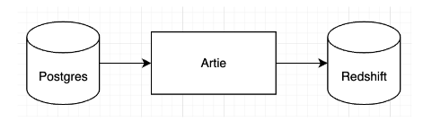

Routable, an accounts payable software provider, uses Artie to sync financial transactions and other production data from Postgres to Redshift in real-time. With Artie, Routable’s Risk and Compliance team is catching fraudulent transactions more effectively, enabling the whole organization to have higher confidence in rolling out innovative products like Instant Pay, helping their customers get paid faster.

> Discovering Artie has been a game-changer in our data management strategy. In an arena where real-time access to data can define market leadership, their tool bridges the gap between our database and data warehouse with seamless, zero-latency synchronization. For a company that's just started its journey, Artie is already setting benchmarks that rivals like Fivetran and Airbyte should watch. An essential tool for anyone serious about making data-driven decisions at the speed of now.
>
> <cite>-- Jason Hodson, Director of Data & Analytics at Routable</cite>

# Key Takeaways

1. Routable was using a SaaS batch ELT solution to move data from Postgres to Redshift, and was constrained by the minimum 15 minute sync frequency. The latency presented a problem in the team’s ability to detect fraud and abuse on its platform.
2. Routable chose Artie for its **low latency, data accuracy, and zero day-to-day maintenance**.
3. Transactions that used to take up to an hour to detect and block are now stopped within minutes. With Artie, the company has the **confidence to roll out their Instant Pay** product to other geographies, allowing customers to get paid faster.

## High latency constrained the effectiveness of their Risk & Compliance team

Routable provides accounts payable software that handles invoice processing and payments. The company handles payments domestically and internationally, and offers various payment speeds, including an Instant Pay solution. This means the ability to detect fraud and abuse efficiently is extremely important. Routable was using a SaaS batch ELT solution to move data from Postgres to Redshift, and was constrained by the minimum 15 minute sync frequency. The latency presented a problem in the team’s ability to detect fraud and abuse within internal systems and across customer-facing products.

Detecting and stopping fraudulent financial transactions from happening on their platform needs to happen as fast as possible. The previous pipeline latency and additional time to run data through machine learning models means end-to-end latency of an hour, which could result in significant financial loss for the business. As a trusted financial platform serving other businesses, Routable needed a **database replication solution that could help enhance security and trust for their customers and end users**.

## Artie enables Routable to detect fraudulent transactions in seconds

> Artie is not just another data replication tool. It was designed in a way to enhance usability and reliability. It’s not just about speed; the fidelity of our data remains uncompromised with no unnecessary data type conversions like we saw with our previous solution, ensuring that our insights are as accurate as they are swift.

Jason Hodson, Director of Data & Analytics at Routable, wanted a database replication tool that could sync data from Postgres to Redshift in real-time and with guaranteed data consistency. They picked Artie for several key reasons:

1. Low latency. Production data is **synced to Redshift in seconds**. This reduced end-to-end latency in detecting and stopping fraud, and reduced losses from fraud.
2. Thoughtful design and the tool’s reliability. The pipeline just works and there is zero day-to-day maintenance required.
3. Lower overhead for the data team. Artie does not perform any unnecessary data type conversions, reducing the number of dbt transformations required downstream.

Onboarding new infrastructure tools often comes with disruption to the organization. However, Jason Hodson found the onboarding process impressively swift. The Artie team was also extremely responsive, with any small glitches or UI concerns handled the same day.

## Rolling out Instant Pay to more geographies with confidence

> Artie has fundamentally changed the risk/reward on our Instant Pay product. The company had wanted to roll this feature out to more geographies, and now we have the confidence to do so.

Artie has been game changing to Routable’s Risk and Compliance organization. **Transactions that used to take up to an hour to detect and block are now stopped within minutes**. This has resulted in a **reduction in losses from fraud**. With Artie, the company has the confidence to further roll out their Instant Pay product to other geographies, allowing customers all over the world to get paid faster.

  

**About Artie:** Artie is a real-time data replication solution for databases and data warehouses. Artie leverages change data capture (CDC) and stream processing to perform data syncs in a more reliable and cost efficient way. With Artie, any company can set up streaming pipelines in minutes without coding.

**About Routable:** Routable is a B2B payments-based platform that allows its users to send and receive business-to-business payments. Its platform uses APIs that allows its users to build payments infrastructure in minutes. 
