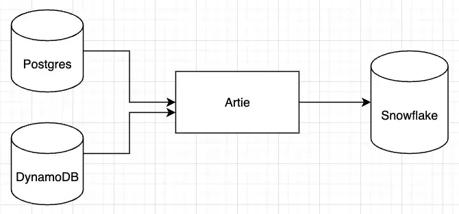

Substack, a leading subscription network, significantly improved its decision-making velocity and data replication efficiency by adopting Artie, a cutting edge change data capture (CDC) streaming solution. Adopting Artie has enabled faster analytics, streamlined operations, and improved business productivity.

> Internal sentiment is extremely positive. Our A/B testing framework measures much faster and we have higher data integrity now. This means the whole company can move faster and make decisions quicker. Artie is business critical and our day to day would be significantly tougher without it.
>  -- <cite>Mike Cohen, Head of Data at Substack</cite>

# Key Takeaways
* Substack wanted a CDC streaming solution to replicate data from Postgres to Snowflake as fast as possible, without putting any strain on database infrastructure. They needed a reliable solution for their most business critical data.
* Artie offered a complete solution with automatic schema detection and ability to handle a broad range of data types, resulting in higher data integrity.
* Artie is transferring ~1 billion rows per month for Substack, with average data latency of 10-15 seconds.

## Substack needed real-time data to increase productivity
Substack has over 35 million active subscriptions and 2 million paid subscriptions. The data and engineering team at Substack tracks metrics and engagement from subscribers, and regularly runs experiments and A/B tests to improve the platform.

Substack uses Snowflake to perform analytics and run BI reports, but their production data primarily lives in Postgres. To get data into Snowflake, the team previously leveraged batched ETLs to move application data from Postgres to Snowflake every few hours and, in some cases, overnight. This was inefficient and waiting hours to get updated data to perform analytics and kick off new workflows meant lower productivity across the organization.

Mike Cohen, the Head of Data at Substack, wanted to upgrade their infrastructure and enable real-time data replication.

> I wanted to adopt a CDC streaming solution to replicate production data from Postgres to Snowflake as fast as possible, without putting any strain on our database infrastructure. I evaluated several batched and streaming ELT solutions and chose Artie. Artie was a very new tool, but we went with them because the tech just worked. Having a reliable solution was extremely important because our database contains the most business critical data.

## Substack chose Artie because it was the only complete CDC solution and it just worked

Substack chose Artie for several reasons:

* Artie has built a custom snapshot solution that is capable of parallel processing for historical table snapshots. It’s also able to read from the read-replica, thus putting less load on the primary database.
* For CDC streaming, Artie is able to ingest large tables quickly without impacting database performance and incurs zero WAL growth on Postgres instances.
* Artie offered a complete solution and also handles schema changes (DDLs), including performing hard deletes, which saves Substack’s data team a lot of engineering time. With other CDC streaming solutions, Substack’s engineering team would have to write custom jobs to detect schema changes from CDC events, materialize the new table, and merge results into the final table in Snowflake that is used for downstream analytics. With Artie, these steps are all automated.
* Artie’s ability to support various data types and complex table formats, such as TOAST columns and tables with composite keys, which are complicated to manage with CDC.
* Using CDC and Artie’s optimizations, such as deduplications, means Substack is able to use an XS Snowflake virtual data warehouse to ingest billions of rows of data per month, optimizing compute costs while maintaining very low latency of ~10-15 seconds.

## A/B testing and higher data integrity with Artie
Implementation was very easy and it took two weeks to fully onboard a couple hundred tables. Substack’s team simply had to enable networking permissions and provide Postgres and Snowflake credentials on the dashboard to get the connector up and running. After that, it just worked.

> The Artie team was very responsive to feedback and easy to work with, and they were very knowledgeable about the space.

Today, Artie is powering the entire Postgres to Snowflake data replication process. Substack recently adopted a second connector to sync data from DynamoDB to Snowflake. Artie is transferring ~1 billion rows per month with average data latency across tables of 10-15 seconds. In addition, total cost of ownership on overall data infrastructure was lowered given Artie’s optimizations and sync efficiency.
  

**About Artie**: Artie is a real time data replication solution for databases and data warehouses. Artie leverages change data capture (CDC) and stream processing to perform data syncs in a more efficient way, which enables sub-minute latency and helps optimize compute costs. With Artie, any company can set up streaming pipelines in minutes without coding.

**About Substack**: [Substack](https://substack.com/) is a subscription network that provides publishing, payments, analytics, and design infrastructure. On Substack, writers and creators can publish their work and make money from paid subscriptions while readers can directly support the work that they deeply value. Today Substack's subscription network encompasses more than 35 million active subscriptions, including 2 million paid subscriptions.
