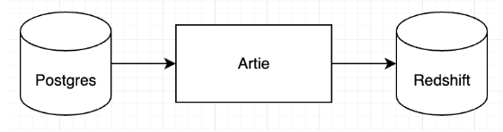

Tatango, a SMS and MMS marketing software provider that accelerates fundraising for nonprofit organizations, chose Artie to replicate data from Postgres to Redshift. Tatango processes more than a billion Postgres records per month and Artie was the only vendor that satisfied Tatango’s requirements for low latency and high availability. Adopting Artie has enabled access to real-time message sending data which powers accurate billing and customer-facing campaign metrics.

> The product and engineering teams at Tatango are able to provide near real-time sending and performance related analytics to our customers, enabling them to focus on what matters most; raising donations.
>  -- <cite>Matt Powers, CTO at Tatango</cite>

# Key Takeaways

1. Tatango’s existing streaming solution (Amazon DMS) was unreliable, especially under extreme load. When Amazon DMS had to handle millions of updates and inserts in a second, the pipeline would completely break down, which resulted in operational overhead and unhappy customers.
2. Tatango spent months evaluating various solutions, and chose Artie for its reliability under spikey volumes and key features like the ability to ignore delete operations.
3. With Artie, average data latency is in the 5-30 second range, so product and engineering teams have access to accurate customer sending data which significantly improves their billing operations. Tatango is also able to offer their customers near real-time access to campaign metrics to monitor performance.

## Tatango’s existing streaming solution was unreliable in handling traffic spikes
SMS/MMS performance metrics are critical to the day to day operations at Tatango. Message sending is core to Tatango and their existing data replication solutions were simply not robust enough to handle Tatango’s scale. Prior to Artie, most of Tatango’s Postgres tables were either streamed or batched, using a combination of Amazon DMS and Stitch, to Amazon Redshift. Matt Powers, CTO of Tatango, was frustrated with Amazon DMS because of its unreliability during periods of  high load on Postgres, which correlates to high sending patterns. When there were spikes of millions of messages, the data latency could be as high as 6 hours and the pipeline would completely shut down. This created significant operating issues as the messaging data is critical to measuring the health of the business and providing campaign metrics. Additionally, their Postgres replication slot would grow during downtimes, which put their production database at risk.

**Amazon DMS also does not provide the ability to ignore deletions on records**, which meant Tatango was keeping a full history of sending data in Postgres. This meant Tatango was keeping over 10 years of sending data in Postgres, which became untenable.

## Tatango chose Artie for high reliability and scalability

> Implementing new tooling can be tough and there is always a learning curve. We were trying to establish a new performance standard while simultaneously trying to adopt a new architecture pattern which would scale with the business. The Artie team was extremely accommodating to changes throughout the process. **It was one of the best customer experiences I have had standing up a new service.**

Matt Powers wanted a more reliable solution that also offered low latency. He spent months evaluating various SaaS solutions in the market, including Stitch, Fivetran, and Airbyte. At the end of the day, they picked Artie for several key reasons:

* Artie’s ability to handle spikes in sending data with zero downtime. Average data latency is measured in 5-30 seconds. Latency increases into the minutes with large spikes of millions of messages sent per second, which is expected as these include stateful data changes, and the pipeline has experienced zero downtime since adoption.
* Artie’s ability to ignore delete operations. Artie provided a mechanism to offload all data transformations quickly and reliably to Redshift and gave Tatango the ability to ignore deletes, which freed up over 10TB in their Postgres instance, leading to significant cost savings and allowed them to right size their Postgres instance.
* Working with a highly technical team that strives to deeply understand the problem Tatango needed to solve, and goes above and beyond to find the best solution.

## Artie enables Tatango to provide a near real-time experience for their customers

With Artie, the internal product and engineering teams now understand customer sending behavior faster and their billing system is significantly more accurate. Moreover, Tatango’s customers are now able to see more detailed message sending data, campaign performance, and billing information on their dashboard.

> Artie is powering our most important tables today. We are still using other tools to pipe data simply because we don’t need high availability on those tables. However, I do imagine we will migrate all other databases and tables to Artie at some point.

For Matt Powers, implementing Artie means he no longer has to constantly update key stakeholders on why data was lagging across the system. Tatango prides itself on being highly available and providing a near real-time experience for their customers. With Artie, their data capabilities are now true to that standard.

  

**About Artie**: Artie is a real time data replication solution for databases and data warehouses. Artie leverages change data capture (CDC) and stream processing to perform data syncs in a more efficient way, which enables sub-minute latency and helps optimize compute costs. With Artie, any company can set up streaming pipelines in minutes without coding.

**About Tatango**: [Tatango](https://www.tatango.com/) provides SMS and MMS marketing software to nonprofit organizations so they can drive engagement and achieve fundraising goals. Made to serve the needs of high-volume senders, the company has sent billions of messages and helped organizations fundraise over $400 million.
